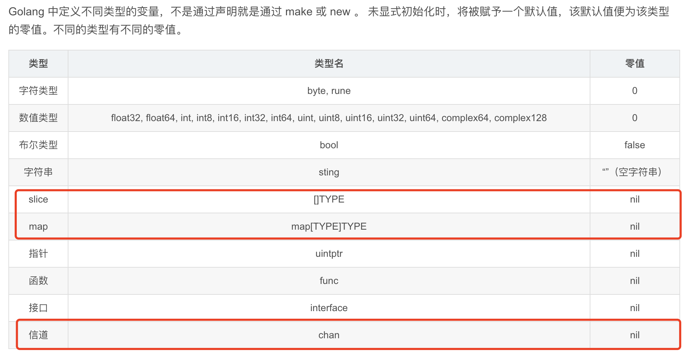

# 基础八股

## make 和 new 的区别

- 同： 都会给变量分配内存
- 异：
  - 适用的类型不同：
    - make 仅仅可用于初始化 map、channel、slice(此时必须指定大小)
    - new 用于为任意 Type 分配内存，返回一个该 Type 的零值对象的指针。注意到 map、channel、slice 属于引用类型，如果使用 new，返回的会是 nil(引用类型的零值)，是不能直接赋值的。
  - make 返回所构建数据结构对象本身，而 new 会返回所构建类型零值对象的指针。
  - new 分配内存后会设置为零值，而 make 分配空间后会进行初始化。
    

# 内存模型

# 并发模型

# 垃圾回收

# 常用包

# 数据结构原理

# 一些核心概念

- reflect
- 闭包
- defer
- recover
- panic
- channel
  - 有缓冲的
  - 无缓冲的
- gin.Context
