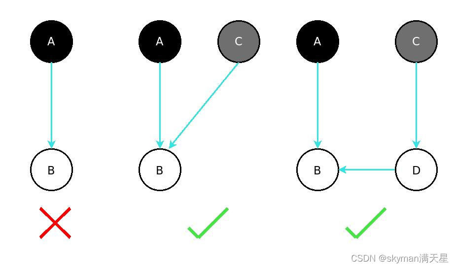

# 基础八股

## make 和 new 的区别

- 同： 都会给变量分配内存
- 异：
  - 适用的类型不同：
    - make 仅仅可用于初始化 map、channel、slice(此时必须指定大小)
    - new 用于为任意 Type 分配内存，返回一个该 Type 的零值对象的指针。注意到 map、channel、slice 属于引用类型，如果使用 new，返回的会是 nil(引用类型的零值)，是不能直接赋值的。
  - make 返回所构建数据结构对象本身，而 new 会返回所构建类型零值对象的指针。
  - new 分配内存后会设置为零值，而 make 分配空间后会进行初始化。
    

## 数组和切片的区别

- 同：
  - 只能存储一组相同数据类型的数据结构
  - 都是通过下标来访问，有容量长度，长度通过 len 获取，容量通过 cap 获取
- 异：
  - 数组定长，访问和复制不能超过数组定义的长度，否则就会下标越界，切片长度和容量可以自动扩容。
  - 数组是值类型，而切片是引用类型，每一个切片都引用了一个底层数组。修改切片的时候，改的是底层数组中的数据，切片一旦扩容，就会指向一个新的底层数组，内存地址也会随之改变。（slice = append(slice, newObj)）
- 切片的截取操作

  - s[n] slice 中 index 为 n 的元素
  - s[low:] 从 index=low 开始截取到尾部
  - s[:high] 从头部开始截取到 index 为 high-1 的元素（左闭右开）
  - s[low:high] 从 low 开始截取到 index 为 high-1 的元素（左闭右开）
  - s[low:high:max] 同上，同时会将返回的新 slice 的 capacity 设置为 max-low

  在 golang 中一个 slice 类型的元素，其本质是一个结构体，其中包含一个元素数组、长度 length、容量 capacity。
  当使用截取操作创建新的 slice 时，会复用原 slice 底层的那个元素数组，同时维护新的 length 和 capacity，当新 slice 发生扩容之后，底层的元素数组才会改变。

## for range

在 for a,b := range c 遍历中， a 和 b 在内存中只会存在一份，即之后每次循环时遍历到的数据都是以值覆盖的方式赋给 a 和 b，a，b 的内存地址始终不变。由于有这个特性，for 循环里面如果开协程，不要直接把 a 或者 b 的地址传给协程。解决办法：① 在每次循环时，创建一个临时变量。② 把 a、b 的值当做参数传给协程。

- for range 用在数组上时，每一轮的 val 都是对循环开始之前数组的 index 位置值的拷贝，而不是在本次循环时原数组 index 位置的值。
- 用在 slice 上时，每一轮的 val 都是切片 idx 位置当前元素的值。
- 在 for range 的过程中向 slice 中 append 元素，并不会增加循环的次数。

## defer 与 return 机制

defer 是 Go 语言中的一个关键字（延迟调用），一般用于释放资源和连接、关闭文件、释放锁等。和 defer 类似的有 java 的 finally 和 C++的析构函数，这些语句一般是一定会执行的（某些特殊情况后文会提到），不过析构函数析构的是对象，而 defer 后面一般跟函数或方法。

- 在一个函数里，可以多次 defer some_func()，当函数 return 或者出现 panic 后，以后入先出的方式执行。
- 在声明 defer 的时候，给函数传入的参数是值传递，即在 defer 声明的那一刻就确定了入参的值；若是通过闭包的方式在 defer 后的函数里引用了外部的变量，那么在 defer 执行时，使用到的就是此时此刻该变量的值。
- 那些声明在 return 之后的，或者在发生 panic 位置之后的 defer 不会被加入栈中被执行。
- 在不考虑 panic 的情况下，执行顺序为：return -> defer_late -> ... defer_early.
  - 当函数返回值匿名时，return 后跟着的值就是函数最终将返回的值，此时 defer 里不管如何操作都不会影响返回值
  - 当函数返回值具名时，真正返回的值就是 return 后跟着的变量的值，此时如果通过闭包的方式在 defer 里将这个变量的值改变了，那么会影响最终返回值
  - 如果返回值是一个指针，那么在 defer 里对这个指针指向的对象做出了修改，也会影响最终返回指针指向的对象的值。
  - 调用 os.Exit 时 defer 不会被执行（直接把进程干掉了）
  - defer 的底层是 gorutine 维护的一个\_defer 链表，每声明一个 defer，便会创建一个\_defer 并放在链表的头部，在 goroutine 返回或者 panic 的时候，从头部开始执行。

## recover

当函数主动调用 panic 或者调用的方法抛出了 panic，会立即停止函数的执行，转而后进先出地执行在 panic 发生之前所有声明的 defer，其中有 recover 就能抓到，如果都没有，则会向本函数的调用者抛出 panic。

## 函数接收对象

- struct 接受
  某个对象在调用该方法的时候，本质会拷贝一个当前对象再执行，即如果方法里改变了 struct 内字段的值，并不会影响到该调用对象的值。
- struct 指针接受
  某个对象在调用该方法的时候，如果修改了 struct 的字段值，会直接影响被调用对象。

  ```golang
  func testFuncReceiver() {
    p := Person{ "georgayang" }
    p.SetName("123")			//  这个SetName只会修改拷贝后p的Name  而不会真正修改p的Name
    p.SayHello()	// georgayang
  }

  type Person struct {
    Name string
  }

  func (p Person) SayHello() {
    fmt.Println("我是", p.Name)
  }

  func (p Person) SetName(newName string) {
    p.Name = newName
  }
  ```

## uint 类型溢出问题

```golang
func testUintOverflow() {
	 var a uint32 = 0			// 32位 无符号数   0000 0000 0000 0000 0000 0000 0000 0000
	 var b uint32 = 1			// 				 0000 0000 0000 0000 0000 0000 0000 0001
	 // a - b = a + 补码(b)    补码 = 正数 ? 本身 : 反码 + 1    反码 = 符号位不变 + 其余位置取反
	 // 补码(b) = 反码(b) + 1 = 1111 1111 1111 1111 1111 1111 1111 1110 + 1 = 1111 1111 1111 1111 1111 1111 1111 1111 = 无符号的2^32 - 1 = 有符号的 - 2^31
	 fmt.Println(a - b) // 2^32 - 1
}
```

## rune 类型

相当 int32

```golang
// rune is an alias for int32 and is equivalent to int32 in all ways. It is
// used, by convention, to distinguish character values from integer values.
type rune = int32
```

golang 中的字符串底层实现是通过 byte 数组的，中文字符在 unicode 下占 2 个字节，在 utf-8 编码下占 3 个字节，而 golang 默认编码正好是 utf-8

byte 等同于 int8，常用来处理 ascii 字符

rune 等同于 int32,常用来处理 unicode 或 utf-8 字符

## 单引号、双引号、反引号的区别

- 单引号表示 byte 类型或者 rune 类型，默认是后者。
- 双引号指的是字符串，底层是 byte 数组。
- 反引号指的是字符串字面量，不支持任何转义序列（可以比较舒服地换行）。

# 内存模型
# 协程模型
GMP模型
# 并发模型
CSP模型   Communicating Sequential Process
# 垃圾回收
https://blog.csdn.net/Dong_chongwu/article/details/128710443
# 常用包

# 数据结构原理

## slice

答：Go 的 slice 底层数据结构是由一个 array 指针指向底层数组，len 表示切片长度，cap 表示切片容量。

slice 的主要实现是扩容。对于 append 向 slice 添加元素时，假如 slice 容量够用，则追加新元素进去，slice.len++，返回原来的 slice。

当原容量不够，则 slice 先扩容，扩容之后 slice 得到新的 slice，将元素追加进新的 slice，slice.len++，返回新的 slice。

### 为什么 slice 作为参数传入函数内，有时候外部的数组内容会被修改，有时候又不会？

slice 是引用类型，传入的指针会指向函数外 slice 底层的数组，如果在函数内部没有发生扩容，那么对 slice 做出修改就是在原数组上修改，反之会在扩容之后对新数组做修改，所以不会影响到外部的 slice。

### 对于切片的扩容规则：

- 当切片比较小时（容量小于 1024），则采用较大的扩容倍速进行扩容（新的扩容会是原来的 2 倍），避免频繁扩容，从而减少内存分配的次数和数据拷贝的代价。
- 当切片较大的时（原来的 slice 的容量大于或者等于 1024），采用较小的扩容倍速（新的扩容将扩大大于或者等于原来 1.25 倍），主要避免空间浪费，网上其实很多总结的是 1.25 倍，那是在不考虑内存对齐的情况下，实际上还要考虑内存对齐，扩容是大于或者等于 1.25 倍。

## map

1. 并发安全吗？

- 使用时一定要先用 make 做初始化，不然报空指针
- 是并发不安全的，并发读写时会出现 panic

2. 循环是有序的吗？

- 是无序的，for range map 在开始处理循环逻辑的时候就会做随机播种，避免顺序遍历。
- 从底层结构来看，hmap在发生扩容时，原来bucket中的值会搬迁到新的bucket中去，而for range map的原理就是遍历底层的bucket链表数组，如此看来对它的遍历注定是乱序的。

3. map 中删除一个 key，它的内存会释放吗？

- 如果删除的元素是值类型，如 int，float，bool，string 以及数组和 struct，map 的内存不会自动释放

- 如果删除的元素是引用类型，如指针，slice，map，chan 等，map 的内存会自动释放，但释放的内存是子元素应用类型的内存占用

- 将 map 设置为 nil 后，内存被回收。

4. 如何并发访问 map

- sync.Map
- 加读写锁
- 乐观锁 原子操作 ChangeAndSwap

5. 底层数据结构是什么？ 怎么扩容的？

- 底层是 hash table，用链表来解决冲突，这里说的 table 是一个 bucket 数组，每一个 bucket 底层都是一个 bmap ，一个 bmap 可以放 8 个 kv（key连续存放、val连续存放，更高效利用内存）。
- 当一个bucket中元素存满了之后，bucket会有一个指针指向下一个溢出桶，构成类似于一个bucket链表的结构。
- 整个hmap的结构体中会有一个变量B，表示map底层正维护着2^B个bucket，他们全是正式桶；当B > 4时，hmap会认为很有可能会使用到溢出桶，于是会预先分配2^(B-4)个溢出桶，它们在内存上与正式桶是连续的。
- hmap底层是通过计算负载因子来进行扩容的，即map所存元素数量 / bucket数量，阈值默认为6.5，当执行完一次写操作后该负载因子超过阈值，则会翻倍扩容；如果负载因子没有超过阈值，但是hmap中已使用的溢出桶超过一定数量（当B <= 15, 溢出桶数量大于2^B;当B> 15， 溢出桶数量大于2^15），就会触发等量扩容。
- 翻倍扩容的过程是渐进式的，每一次写操作触发扩容后，至多只会迁移两个bucket中的数据到新桶，这样做可以避免扩容瞬间对整个map读写性能的抖动影响。
- 等量扩容触发是因为hmap在写过程中，一边写一边删，导致每个bucket中的bmap非常稀疏（即8个坑位没占满），等量扩容可以对这些数据进行规整，提高内存利用率和读写的效率。


# 一些核心概念

## select
  golang 中的 IO 多路复用机制，主要针对多个 chan 同时读取的场景：

  - 每个 case 里只能处理一个 channel，要么读要么写

  - 多个 case 的执行顺序是随机的

  ```golang
  select {
    case data1 := <- ch1 :{
      // ...
    }
    case data2 := <- ch2 :{
      // ...
    }
    case ch3 <- :{
      // ...
    }
    default : {
      //
    }
  }
  ```

## 垃圾回收

垃圾回收是一种自动内存管理机制，它能够将进程将不再使用的对象进行清理，从而释放出更多内存。

一般而言，垃圾回收分为两个步骤，首先要将垃圾识别出来、然后再对其做清理。

较常用的垃圾识别算法有：
  1. 引用计数法 在对象上增加它被引用的次数，当某个对象的引用数为0时，说明它已不再被使用，可以被回收。
  2. 可达性分析法 通过判断一个对象是否可达，来判断它是否被其他对象所使用。

引用计数法简单、回收高效，但是需要额外的空间来存储计数且会有循环引用的问题。

可达性分析方法避免了循环引用的问题，但是其判断一个对象是否可达的过程需要引入STW，并由GC线程来扫描堆栈上的变量。

go语言使用的是后者，具体又被称为 「三色标记法」。

而垃圾清理一般有三种实现方法：
1. 标记清理  在标记阶段会暂停程序的执行，从gc-root出发来标记那些存活的对象，清理阶段将不可达对象释放，并将清理出来的内存加入到空闲链表，最后恢复程序的执行；它实现简单，但是会有较长时间的STW和内存碎片问题。
2. 标记复制  将整体内存分为FROM和TO两部分，每次从gc-root出发，将可达的对象复制到to区域去，之后统一清理整块FROM区域；它解决了内存碎片的问题，但是复制成本和内存利用率低。
3. 标记压缩  主要思想是将可达的对象压缩到内存的一端，避免内存碎片的产生；整理过程较复杂，STW时间较长。

## 三色标记法

golang的垃圾回收采用的是标记-清理法，整体经过了很多版本的演进：
### v1.0 串行标记清除 + STW

标记和清理两个过程都需要STW，并且是单线程作业，导致程序卡顿时间很长
### v1.3 并行标记清除 + STW

清理阶段移除了STW，并且开启多线程进行清理，允许清理线程和用户线程同时进行
### v1.5 三色标记法

将标记阶段的STW时间继续压缩，在这段时间内使用多线程进行初始标记，然后多个标记线程和用户线程一起执行，最后再来一个短暂的STW进行最终标记。

- 黑 gc-root（全局变量、栈上的变量）可达的那些对象，并且该对象所引用的对象都已经被标记成黑色或者灰色。
- 灰 gc-root可达的，但是该对象所引用的对象还没有全部被标记成灰色
- 白 gc-root根本就不可达的，或者是还没有来得及被标记成黑色或者灰色的对象

在gc开始时，gc-root就会被标记成黑色，而他们所引用的对象都会被标记成灰色，其他的对象全都是白色，当最终标记阶段结束之后，剩下的白色对象就需要被回收了。

4. v1.8 混合写屏障
当初始标记阶段结束之后，程序恢复运行，同时多个标记线程会并发地基于三色标记法继续标记内存中的对象，这个时候如果程序创建了新的对象或者给旧对象添加了新的引用，势必就会影响正在进行的标记工作，从而产生浮动垃圾和错误标记两类问题。
    - 浮动垃圾： 假设一个非gc-root的对象变黑之后，它唯一的引用被用户线程断开，那么它此时其实已经是个垃圾了，但是在本轮gc中它不会再被关注到，所以最快只能在下一次gc发生时被回收。
    - 错误标记：假设有一个灰色对象引用了一个白色对象，在还没将白色标记成灰色之前就断开他们之间的引用，转而让另一个黑色对象引用白色对象，因为本轮gc中该黑色对象不会再被处理，那么挂载它下面的白色对象也就一直白色，本轮gc之后就会将它回收，但其实它依旧被黑色对象所引用着，这就可能造成程序的错误。

由此可见，错误标记的问题会引发程序异常，这是不可接受的，于是引入了「三色不变式」这个概念：
- 强三色不变式： 在并发标记阶段，不允许黑色对象创建到白色对象的新引用。


- 弱三色不变式： 在并发标记阶段，允许黑色对象创建到白色对象的新引用，但是必须保证还有其他灰色对象引用这个白色对象，或者其他的灰色对象通过多个白色对象可以到达它。


只要能够保证三色不变式，就能避免错误标记的发生，而具体的实现方式就是「写屏障」。

所谓「写屏障」，就是对于程序中的变量赋值操作，在其前后加上某些操作，来保证三色不变式。

例如要保证强三色不变式，如果黑色对象要引用一个白色对象，那么就可以在这一条赋值语句前后将白色对象变成灰色。

但是从汇编角度看，加入屏障会在原本一条赋值命令前后增加十几条额外命令，这势必会降低程序运行速度，而程序代码中绝大多数的赋值操作都是针对栈上变量的，如果对栈上变量的赋值都采用写屏障，程序就会慢的一批；但是如果只对堆上变量使用写屏障，那么栈上对象依然会产生错误标记问题，于是在写屏障的基础之上，优化得来了：
- 插入写屏障 incremental update

  满足的是强三色不变式。
  它在并行标记阶段只处理那些堆上变量的赋值。
  当堆上的一个变量A引用某个变量X时，如果X是白色的，那么就把X变成灰色。
  插入写屏障不管那些栈上对象引用其他的对象。
  在最终标记阶段会再次进入STW，此时重新标记并扫描栈上的变量，对他们做可达性分析，防止栈上对象出现错误标记。

  缺点在于最终标记阶段需要再次扫描栈上对象，第二次STW时间长。
  > 理解： 强三色不变式是不允许黑色节点新建到白色节点的引用，这里在创建引用的时候把白色变成灰色，所以满足。

  

- 删除写屏障 snapshot-at-the-beginning

  满足的是弱三色不变式。
  在第一次STW时，要将所有栈上对象标记成黑色，而将他们引用的对象变成灰色。
  在并发标记阶段，如果堆上变量A断开了到某个对象X的引用，如果X是白色的，那就把X变成灰色。
  在最终标记阶段的STW中，不再需要去重新扫描栈上对象，而只需要进行清理阶段的准备工作。

  缺点在于首次标记阶段要将所有栈上变量变成黑色，首次STW时间长，另外被断开引用的白色对象都会变灰，他们很可能成为浮动垃圾，即回收精度不高。
  > 理解： 弱三色不变式是允许新建黑色到白色的引用，但是要保证这个白色能被其他灰色节点可达。当我断开到白色节点的引用时（不论它之前是被什么颜色节点引用的），它之后都有可能被其他黑色节点重新引用，但是我又没办法保证它能被其他灰色可达，所以干脆把它变成灰色。即将所有因为引用断开而出现的游离白色对象变成灰的，以此避免它被黑色重新引用从而被错误删除。

  

- 混合写屏障

  它解决了插入写屏障在最终标记阶段要重新扫描栈上对象的缺点、也解决了删除写屏障在首次标记阶段要将栈上对象全都变成黑色、引用对象变成灰色的缺点，大幅降低了STW的时间。

  具体地，当某个协程需要标记其栈内存上对象时，会暂停当前goroutine的执行，等标记完了之后再恢复goroutine的执行。
  在并行标记阶段，如果goroutine堆上的对象A断开到对象X的引用，转而创建到对象Y的引用，那么会将X变灰（这与删除写屏障类似），如果此时该goroutine的栈对象已经被标记过了，那么就不处理Y，否则会将Y变灰色（这又与插入写屏障类似）。

  > 理解：本质上，这三种写屏障都是为了在兼顾程序执行性能的同时，保证标记过程中的三色不变式，混合写屏障结合了前二者对堆上变量新增、断开引用的操作，并考虑到了各个goroutine上栈对象标记的状况，保证在整个过程中栈上对象都不会出现错误标记。
  


  > golang的垃圾回收详解
 https://blog.csdn.net/weixin_38693938/article/details/128897510?spm=1001.2014.3001.5506
## GMP 模型

 - 进程

   进程是运行在计算机上的一个程序实例，它是操作系统分配系统资源（CPU时间、内存空间、文件资源）的基本单位，每一个进程都有自己独立的内存空间、代码段、数据和系统资源。
 - 线程

    线程又被称为轻量级的进程，它是进程中的最小执行单元。
    
    在当代操作系统的实现中，一般来说线程就是CPU调度的基本单位。

    进程中的每个线程都有自己的程序计数器、栈内存和寄存器资源，一个进程创建的若干个线程之间能够共享进程的内存空间和系统资源。

 - 协程

    在多线程时代，引入多个线程能够提高CPU多个核心的利用率。
    
    但是随着当代后台服务业务的复杂化、并发量的不断增大，对于每一个请求都开辟新的线程进行处理，会导致大量的内存占用和上下文切换开销。

    于是协程这个概念正在被越来越多的编程语言所实现（go、Python、erlang、lua...），协程的思想即用户态的轻量级线程，它的本质是由应用自己实现协程与线程之间的绑定和调度关系，用更小的开销来满足越来越多的并发逻辑。对于操作系统而言，进程之上依旧是若干个线程，它并不关心用户态程序中的协程的具体细节，完全由程序自身控制。

  > GMP模型本质上上就是go语言中，实现协程goroutine与线程进行动态绑定的一套机制。

  - G goroutine          
  
    golang中对协程的抽象，g有着自己的栈内存、状态和任务函数，g需要绑定到p上才能够执行。
  - P processor          
  
    是维护goroutine和machine绑定关系的调度器，对于m来说，p是它的执行代理，p中包含着线程执行的必要信息（可执行的g、内存分配情况、复杂的调度细节）；p的数量决定了g的最大并行数量。
  - M machine/thread     

    是golang中对线程的抽象，m不直接执行g，而是先和p进行绑定，由其实现代理。

    由于p的存在，m本身不保存g的任何信息，所以能够实现g的灵活调度，在g的生命周期中它可以跨m执行。


  最早期的goroutine调度中，没有P这个概念，仅有全局g队列和若干个machine，每一个m需要直接在全局g队列中获取g并执行，执行完毕后再将g放回，这两个动作都需要加锁。这就导致很强的锁竞争，效率低下。
  


  现代的GMP模型整体可以描述如下：

  整个模型由三部分构成：
  1. 最顶层的全局g队列。
  2. 若干个processor，每一个p内部都有一个本地g队列。p的数量等于GOMAXPROCS这个环境变量（在gov1.5之前默认为1，这之后为当前机器的CPU核心数量）。
  3. 若干个machine，每一个m都对应go进程中的一个真实线程，它们由操作系统来调度。

  

  > 调度器的几个重要机制
  1. work-stealing机制

    由某一个g创建的新协程，将优先被放置在当前p的本地g队列中（最大256个），当放不下时就会放到全局g队列里去。

    当一个p执行完一个g或者达到了最大调度时间（10ms），就会把这个g放回本地队列，并试图获取下一个g，如果本地g队列为空了，就会去全局g队列获取，如果也没有，则会随机选择其他的p，去窃取它本地队列中一半的g。
  2. hand-off机制

  当m因为g中程序进行系统调用（如读写文件）而发生阻塞时，m会主动释放这个p，并交由空闲的m或者创新新的m来接管这个p，从而去调度别的g；而当前这个m则会绑定那个正在阻塞的g，等待阻塞操作的完成。之所以要将m和p分离，是因为同步系统调用的阻塞会导致当前m也阻塞，它没有办法去调度和执行其他的p。

  注意到，这里说的系统调用阻塞不包括网络I/O，对于这类阻塞go提供了网络轮询器（NetPoller），p会将g交给NetPoller进行监听，转而调度LocalRunnableQueue中其他的g，这个过程中不需要将p和m进行分离。这个NP其实在workstealing中也会出现，p会试图在LRQ、GRQ、NP、其他P的LRQ中获取新的g进行调度。

  如果是由于元子、互斥量、通道操作导致的阻塞，p将会将当前阻塞的g放回LRQ中并调度下一个g。

  
  3. 抢占式调度

  当p绑定了m并开始执行g时，会有一个全局monitor来定期检查每一个g的运行时间，如果超过了10ms，就会将g丢回LRQ，转而调度下一个g，避免某一个g长时间占用CPU时间而导致其他g产生饥饿。
## CSP

通常多线程之间进行通信的方式就是共享内存（全局变量 + 互斥锁），还有就是基于消息队列/socket/事件机制进行通信。

这里的Communicating Sequencial Process，指的是golang中的一种并发模型，即基于channel机制，来实现协程之间的通信。

  > Do not communicate by sharing memory, instead, share memory by communicating.

## channel

golang中的channel有两种：①无缓冲区的chan ②有缓冲区的chan

前者要求参与通信的双方同时到位，否则就会有一方阻塞在读/写channel的操作上。

后者允许在chan塞满之前，即时地写入数据，也允许在chan非空时即时地读出数据。

 > 对channel常用的操作：
  ```go
  // 创建channel
  ch1 := make(chan int)   
  ch2 := make(chan someStruct) 
  ch3 := make(chan struct{}) // 空结构体channel  常用作信号的传递，往里面写入struct{}{} 可以在不占用内存的情况下传递信号

  // 创建有缓冲区的channel
  ch4 := make(chan int, 10)  

  // 关闭channel
  close(ch4)

  // 在入参中指定channel可读/可写

  func foo(ch chan int)   // 可读可写的chan
  func foo(ch chan<- int) // 只能写的chan
  func foo(ch <-chan int) // 只能读的chan  记忆方式： 看箭头是往chan关键字里写还是读 

  // 向已经被关闭的chan中写入数据  将会panic
  // 从已经关闭的chan中读数据  会返回两个值
  val, ok := <- someClosedChan    // val将会是chan内数据类型的零值 ok会是false

  // 结合select使用
  select {
    case val, ok := <-ch1: {
      // 当ch被关闭时  读出来的val是零值  OK是false
    }
  }

  // 结合range使用  会阻塞地不断从channel里读取数据  如果chan被关闭 则会结束for循环
  for val := range ch1 {

  }
  ```

  >  channel的底层实现
  ```go
  type hchan struct {
    qcount   uint   // channel 里的元素计数
    dataqsiz uint   // 可以缓冲的数量，如 ch := make(chan int, 10)。 此处的 10 即 dataqsiz
    elemsize uint16 // 要发送或接收的数据类型大小
    buf      unsafe.Pointer // 当 channel 设置了缓冲数量时，该 buf 指向一个存储缓冲数据的区域，该区域是一个循环队列的数据结构
    closed   uint32 // 关闭状态
    sendx    uint  // 当 channel 设置了缓冲数量时，数据区域即循环队列此时已发送数据的索引位置
    recvx    uint  // 当 channel 设置了缓冲数量时，数据区域即循环队列此时已接收数据的索引位置
    recvq    waitq // 想读取数据但又被阻塞住的 goroutine 队列
    sendq    waitq // 想发送数据但又被阻塞住的 goroutine 队列
    
    lock mutex
    ...
  }

  比较关键的几个字段：ch内元素数量、ch的缓冲区大小、缓冲区循环队列的头指针、读指针、写指针、读者队列、写者队列、互斥锁
  ```


## reflect
- 闭包
- defer
- recover
- panic
- gin.Context

# 性能排查/调优
https://blog.csdn.net/m0_46251547/article/details/126242661

https://blog.csdn.net/luduoyuan/article/details/128721103?spm=1001.2101.3001.6650.1&utm_medium=distribute.pc_relevant.none-task-blog-2%7Edefault%7ECTRLIST%7ERate-1-128721103-blog-126242661.235%5Ev38%5Epc_relevant_sort_base3&depth_1-utm_source=distribute.pc_relevant.none-task-blog-2%7Edefault%7ECTRLIST%7ERate-1-128721103-blog-126242661.235%5Ev38%5Epc_relevant_sort_base3&utm_relevant_index=2