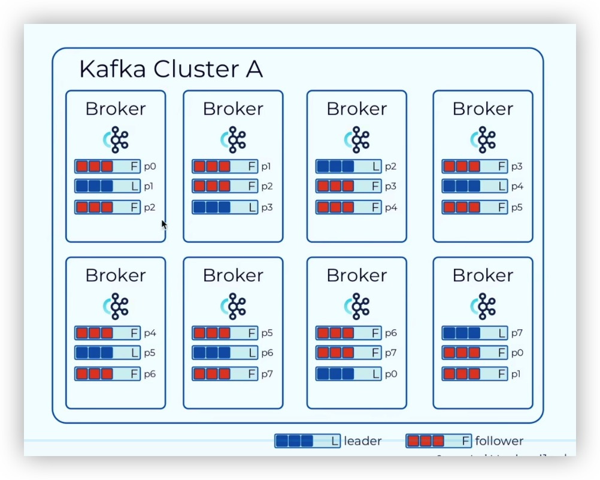

# kafka & rocketmq
- 前者像是水渠，流量大，流速慢，强调更高的吞吐量
- 后者像是高压水枪，吞吐量小但是流速快，强调瞬时的并发处理能力

# kafka为什么快
1. 磁盘顺序读写， 采用append only的方式向partition里追加，只写不删，顺序读写磁盘
2. 页缓存 kafka越过JVM，直接通过操作系统的PageCache，当需要读写磁盘上的文件时，以pageCache作为磁盘的缓存。越过JVM是为了避免它的GC机制带来的开销；另一方面所有In-Process Cache其实都会在OS中有一份一样的PageCache，越过JVM直接使用PageCache至少可以翻倍利用缓存空间。
3. 零拷贝 kafka运行在linux系统上，一般来说当一个进程需要从磁盘读取文件并通过socket发送出去时，需要先将数据读到内核态的pageCache，然后再拷贝到用户态的用户进程的内存空间中，之后再由用户线程将数据写入到内核态的socket缓冲区进行发送；kafka使用了sendfile技术，直接在内核态读取文件到PageCache，然后直接发送到socket缓冲区，避免了拷贝到用户内存这一步，大大提升了I/O效率。
4. 批量处理 提供大量的批处理API，能够基于对数据的压缩合并，以更小的数据包、更快的传输速度对数据进行处理。

# 基础
## kafka简介
- 分布式消息系统 -> 分布式流处理平台
- 吞吐量高、性能好
- 伸缩性好，支持在线水平扩展
- 容错性、可靠性
- 与大数据生态紧密结合，如hadoop、spark等（可以无压力处理TB级别的数据）

## 消息模型
- JMS规范 --- Java Message Service API （Java消息服务）
- AMQP  Advanced Message Queueing Protocol 高级消息队列协议
    - 模型
        - 队列 queues
        - 信箱 exchanges
        - 绑定 bindings
    - 支持事务，数据一致性高，不强调性能，多用于银行、金融行业
    - RabbitMQ、Spring AMQP、Spring JMS
- MQTT Message Queueing Telementry Transport 是一种轻量级的发布/订阅消息传输协议
    - 模型 
        - Client
        - Broker
        - Topic
    - 非常轻量级，消息头只有固定2个字节，适用于带宽和处理能力有限的嵌入式设备上，广泛应用于物联网中。

## 基本概念
  
- Brocker 消息代理
- Topic主题
- Partition分区
- Replication副本
- Segment段
- Producer生产者
- Consumer消费者
- Offset偏移量
- Consumer Group消费者组


    可以理解为关系型数据库中的表，从整体上来看，kafka集群内可以有很多个topic，这是个半结构化的容器，可以将相同/不同类型的消息塞到一个topic里去。

    具体地，在kafka中的每一个topic都可以进行分区，即分散成多个partition存在于集群里的不同brocker上。

    对于每一个partition（可以理解为一个topic的一部分），kafka只会往其尾部写数据，而不会修改或删除之前的数据，每一条消息都会有一个自增的、partition内不重复、partition间可能重复的编号，称之为offset，可用于快速定位某条消息在这个partition中的位置。

    采用partition进行数据分片能够一定程度上提高整体数据的可用性，并让系统能够横向拓展，但是也许需要引入replications来做数据冗余；在kafka里每个partition的备份会分散到其他brocker上，并且会带有leader或follower的标签，集群内对这个partition的读写请求都只会打到leader上，follower只是单纯地同步数据；kafka还会为每这个partition维护一个In-Sync Replica List(ISR)来记录当前同步状况良好的分区集合。

    在每个broker里会有一个特殊的topic，用于存储各个consumer对当前broker上topic的读取offset。（在老版本的kafka中这个信息是存在zookeeper里的）
    ```bash
    [root@VM-141-14-centos ~/kafka/kafka_2.12-2.8.1/bin]# ./kafka-topics.sh --zookeeper localhost:2181 --describe --topic test
    Topic: test     TopicId: 8i9nK73iS6Coa40mO1fF2A PartitionCount: 3       ReplicationFactor: 2    Configs: 
            Topic: test     Partition: 0    Leader: 2       Replicas: 2,1   Isr: 2,1
            Topic: test     Partition: 1    Leader: 0       Replicas: 0,2   Isr: 0,2
            Topic: test     Partition: 2    Leader: 1       Replicas: 1,0   Isr: 1,0
    ```
## 消息类型
## 生产者
## 消费者
## 序列化