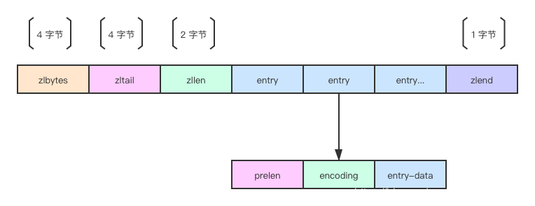
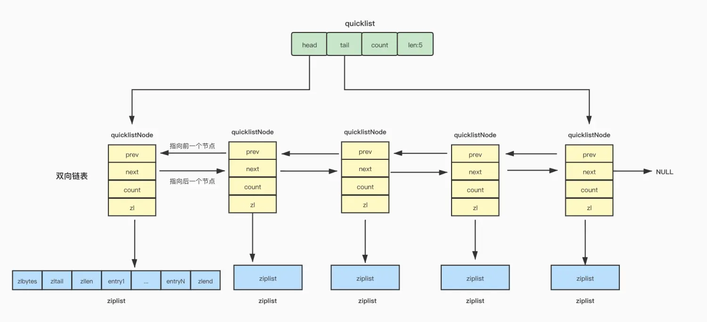
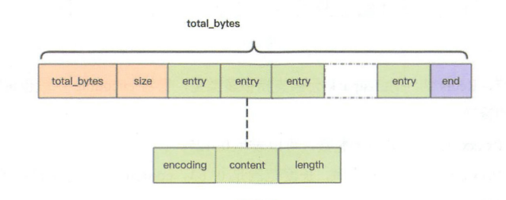

# redis 与传统关系型数据库的区别

# 常用的数据结构

- string

  最常用的单值存储，底层的 RedisObject 有三种 encoding 方式：

  - int

  当 value 为整数且能够被当前操作系统中 C 语言 long 类型所存储的话，那么就会按照 int 的格式存储（long 可能是 32 位也可能是 64 位，取决于 redis 编译时的编译器）。当对 int 编码的值进行修改致使它超过 long 表示的范围后，encoding 就会变成 embstr 或者 raw。

  - embstr

  redisObject 的结构分为【type、encoding、ptr】，当 encoding 为 embstr 时，ptr 存储的是一个 SDS 结构体指针（Simple Dynamic String）简单动态字符串。

  - raw

  当 SDS 的长度超过某个阈值时

  > redis 2.+ --- 32 字节

  > redis 3.0-4.0 --- 39 字节

  > redis 5.0 --- 44 字节

  encoding 会选择 raw，redisObject 底层其实还是 SDS，与 embstr 的区别在于，raw 格式的 object 在创建时，redisObject 结构体和 SDS 结构体是分两次申请内存的，而 embstr 是一次申请。

  embstr 优点在于创建和销毁的时候都只需要操作内存一次，且空间上 object 和 SDS 是连续的，更有利于利用 CPU 缓存。

  缺点在于 embstr 格式的对象是只读的，即如果使用 append 等指令修改其 value 时，底层其实将 encoding 升级为 raw，重新分配 SDS 空间并复制之前的值再做出追加的修改。

  SDS 相较于 C 语言中字符串的优势：

  1. SDS 结构体内部会维护当前字符串的长度 len，使用 strlen 命令获取长度时时间复杂度仅为 O(1)，而 C 语言中仅通过字符串末尾的'\0'来标致结束
  2. 基于 1 中的设计，SDS 的末尾也有一个'\0'，目的是能够复用一部分 string.h 中的库函数
  3. 由于维护了长度 len，SDS 也能存储二进制数据，如图片、音频、视频、压缩文件等
  4. SDS 的 API 非常安全，不用担心对字符串进行操作会造成内存溢出，因为 SDS 的 API 底层会校验剩余可用空间，不够时会进行扩容。

  SDS 的结构体：

  在 redis3.2 版本之前，SDS 的实现还比较简单，内有 len、free、buf 三个元素

  ```c
  struct sdshdr {
      //记录buf数组中已使用字节的数量
      //等于SDS所保存字符串的长度
      unsigned int len;

      //记录buf数组中未使用字节的数量
      unsigned int free;

      //char数组，用于保存字符串
      char buf[];
  };
  ```

  显然，这一版本的实现会有很严重的内存浪费，即非常短的字符串也会在头内用到两个无符号整数来存储（每个 2~4 个字节，取决于编译器），于是 redis 在 3.2 及以后的版本中针对不同长度的字符串，采用了不同的 header：

  根据索要存储字符串的长度，分别采用 1、2、4、8 字节的整型来记录 len 和 buf 的总长度 alloc；采用一个字节的 flag 的低 3 位存储当前 header 采用的字节长度规格（3bit 正好记录 0~7 可以对应 1 到 8 字节）。

  上面四个规格对应 sdshdr8~64，还有个 sdshdr5，这个结构里没有 len 和 alloc，而是使用 flag 的高 5 位来记录 len，不过这个结构只用在了 key 的存储中，而 value 的存储最低只使用了 sdshdr8

  ```c
  // 注意：sdshdr5从未被使用，Redis中只是访问flags。
  /* Note: sdshdr5 is never used, we just access the flags byte directly.
  * However is here to document the layout of type 5 SDS strings. */
  struct __attribute__ ((__packed__)) sdshdr5 {
      unsigned char flags; /* 低3位存储类型, 高5位存储长度 */
      char buf[];
  };
  struct __attribute__ ((__packed__)) sdshdr8 {
      uint8_t len; /* 已使用 */
      uint8_t alloc; /* 总长度，用1字节存储 */
      unsigned char flags; /* 低3位存储类型, 高5位预留 */
      char buf[];
  };
  struct __attribute__ ((__packed__)) sdshdr16 {
      uint16_t len; /* 已使用 */
      uint16_t alloc; /* 总长度，用2字节存储 */
      unsigned char flags; /* 低3位存储类型, 高5位预留 */
      char buf[];
  };
  struct __attribute__ ((__packed__)) sdshdr32 {
      uint32_t len; /* 已使用 */
      uint32_t alloc; /* 总长度，用4字节存储 */
      unsigned char flags; /* 低3位存储类型, 高5位预留 */
      char buf[];
  };
  struct __attribute__ ((__packed__)) sdshdr64 {
      uint64_t len; /* 已使用 */
      uint64_t alloc; /* 总长度，用8字节存储 */
      unsigned char flags; /* 低3位存储类型, 高5位预留 */
      char buf[];
  };
  ```

  注意到上面 struct 声明里的 `__attribute__((__packed__))`，这是在告诉编译器，取消对这个结构体的字节对齐，而是按照实际占用的字节数进行存储，原因是，sds 的指针其实指向的不是结构体的起始地址，而是 buf 的首地址，这是为了让 sds 指针能直接复用 string.h 里的函数；

  如果不进行对齐填充，就能保证 sds 的指针往回退一个字节就能找到 flags 的 8 个 bit，进而根据 header 规格找到 len 和 alloc 的起始位置；相反如果进行了填充对齐，就破坏了这个巧妙地设计。

  > By default, a single Redis string can be a maximum of 512 MB.

  - set key value [EX seconds|PX milliseconds|EXAT timestamp|PXAT milliseconds-timestamp|KEEPTTL] [NX|XX]
  - setnx key value 在老版本 redis 中 setnx 不支持指定过期时间，所以实现分布式锁在加锁的环节需要用 lua 脚本使得 setnx 和 expire 原子地执行。
    > As of Redis version 2.6.12, this command is regarded as deprecated.
    > It can be replaced by SET with the NX argument when migrating or writing new code.
  - get key
  - mget key1 key2 key3 ... 批量获取多个 key
  - mset key1 val1 key2 val2 ... 原子性地批量设置多个 kv
  - msetnx key1 val1 key2 val2 ... 原子性地设置多个 key（当且仅当 key 不存在时才写，不会覆盖）
  - incr key 对于存储整数类型的 key，可以原子性地加 1，注意如果 val 是个浮点数则不能用 incr
  - decr key
  - incrby key intvalue 对于存储整数类型的 key，原子性地增加 intvalue，同样不适用于浮点数
  - decrby
  - incrbyfloat key floatval 可以将整数型的 key 升级成浮点数，此后只能用 incrbyfloat 来修改其值

- list

  线性表结构，按照插入的顺序进行排序，可以用于构建队列/栈的结构，最大存储 2^32 - 1 个元素，即单列表支持存储超过`40亿个数据`。

  list 的数据结构有以下两个阶段：

  - 压缩列表 ziplist （元素数少于 512、每个元素都小于 64 字节） -> 双向链表 list

  - redis3.2 之后 list 底层只使用 quicklist

    - ziplist
      

      entries 占用内存连续，能够更好地利用 CPU 高速缓存。每个 entry 中存储上个 entry 的长度以及当前节点的长度，于是可以根据当前 entry 的指针快速移动到上/下个 entry 的起点。

      相较于链表而言，它能够更高效地利用内存（链表每个节点都要维护两个指针，指针所占字节是很长的，64 位系统一个指针就 8 字节）；但是当所存储元素数量增多后，ziplist 的查询和更新操作效率都很低。

      更致命的是，entry 中的 prelen 在前一个 entry 长度小于 254 时，采用一个字节存储，否则会一下扩大到五个字节（第一个字节固定值为 0xFE，用后面四个字节存储前一个 entry 的字节长度），极端情况下，对 ziplist 中一个元素做出修改使其变长，会导致后面所有节点的 prelen 都发生扩展，极度影响性能。

    - quicklist
      

      quicklist 为了减小 ziplist 产生的连锁更新现象的影响，进行了改造。

      quicklist 可以理解为一个链表，每个节点是一个 ziplist，它严格限制了每个 ziplist 的长度，使其即时发生连锁更新，也不会影响太严重，同时也保证了每一个 ziplist 的查询和更新效率。

      另外，quicklistNode 中 ziplist 还可以采用压缩算法进行压缩，从而生成一个 LZF 结构，node 里的 zl 会指向这个 LZF，进一步压榨内存，提高使用率。

    - listpack
      

    listpack 也是优化 ziplist 后的一种数据结构，它的整体结构与 ziplist 类似，关键在于调整了 entry 内的结构，依次维护

    encoding --- 不同的编码会占 1~5 个字节不等，可以理解为前几个 bit 位用来枚举编码，剩下的比特位用于存储 content 中内容的长度

    data listpack

    slen --- 指的是当前字节对于本 entry 起始地址的偏移量，也是 encoding + content 的总字节长度

- set
- zset
- hash
- hyperloglog
- bitmap
- bitfield
- stream
- geospatial

# 内存清除策略

redis 是一个基于内存的 k-v 数据库，它的持久化策略更偏向于用于数据的恢复，而不是像 innodb 那样用于检索，于是当 redis 进程所分配的内存空间不够用时，它不能将一部分数据持久化到磁盘以腾出内存空间，所以需要引入内存清除策略。

redis 中的策略完整有八种：

1. noeviction --- 不清除策略，当新的写请求到来时，只会去执行那些能让内存占用减少的指令（例如 del 和其他的删除类操作），其他的则返回内存不足的错误从而拒绝写入
2. volatile-lru --- 针对那些设置了过期时间的 key，使用 lru 算法，移除那些最后一次使用时间最远的 key；least recently used 最少最近使用。
3. allkeys-lru --- 针对所有的 key，使用 lru 算法淘汰
4. volatile-lfu --- 针对那些设置了过期时间的 key，使用 lfu 算法，移除那些一段时间内使用频率最低的 key；least frequently used 最少频率使用。
5. allkeys-lfu --- 针对所有的 key，使用 lfu 算法淘汰
6. volatile-ttl --- 针对那些设置了过期时间的 key，把那些距离过期时间最近的 key 移除。
7. volatile-random --- 针对那些设置了过期时间的 key，随机删除
8. allkeys-random --- 针对所有 key，随机删除

如果业务缓存数据真的数量庞大以至于会占满 redis 内存，那就应该考虑使用 redis 集群架构对数据进行分片存储，尽量避免驱逐策略的使用。

实际生产中，不应当把 redis 当做一个可靠的持久化存储设备，而应该是一个为数据库分担压力的缓存层，以保证业务在某些 key 被驱逐时的正确运行。

开启方式： 配置文件中设置 maxmenmory 和 maxmemory-policy，另外 mapmemory-samples [count]是在 lru 和 ttl 的驱逐策略下，会随机去待淘汰队列选取的 key 数量，在这随机捞出来的数据里选最应该被淘汰的，该数值默认是 5，当设置为 10 时基本就趋近于精确的 lru 和 ttl，但是会消耗更多的 cpu 资源。 由此可见，redis 内存驱逐策略中的 lru 和 ttl 都是近似的，而不是完全精确的。

# key 过期策略

redis 中的 key 通过时间戳的方式实现过期，对过期 key 的删除采用的是定时随机检测和惰性删除。

惰性删除指的是，当读取一个 key 的时候，redis 会检查其过期时间与当前系统的时间戳，如果过期则删除它。

定时随机检测

# 持久化策略

# 主从同步原理

# 哨兵模式

# 集群模式

# 分布式锁

## 与用数据库实现、zookeeper、etcd 的异同

# 分布式信号量

# 红锁

# 为什么快？

LSM tree https://zhuanlan.zhihu.com/p/181498475  
bitcask: 简洁且能快速写入的存储系统模型 https://zhuanlan.zhihu.com/p/551334186
