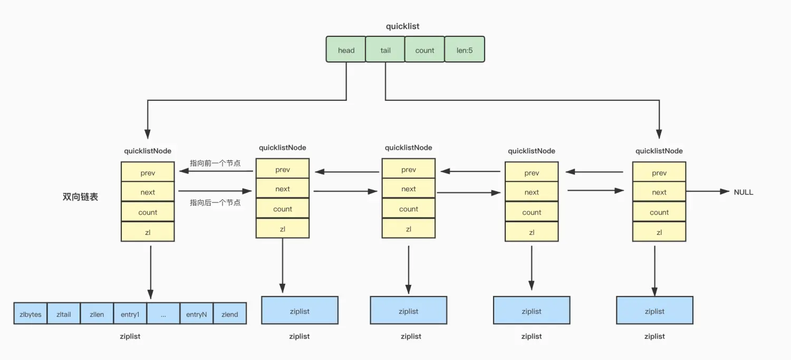
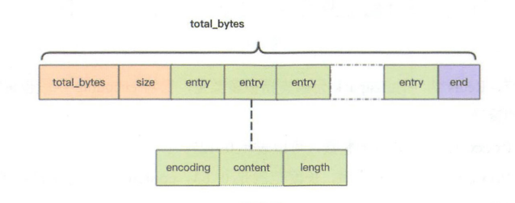
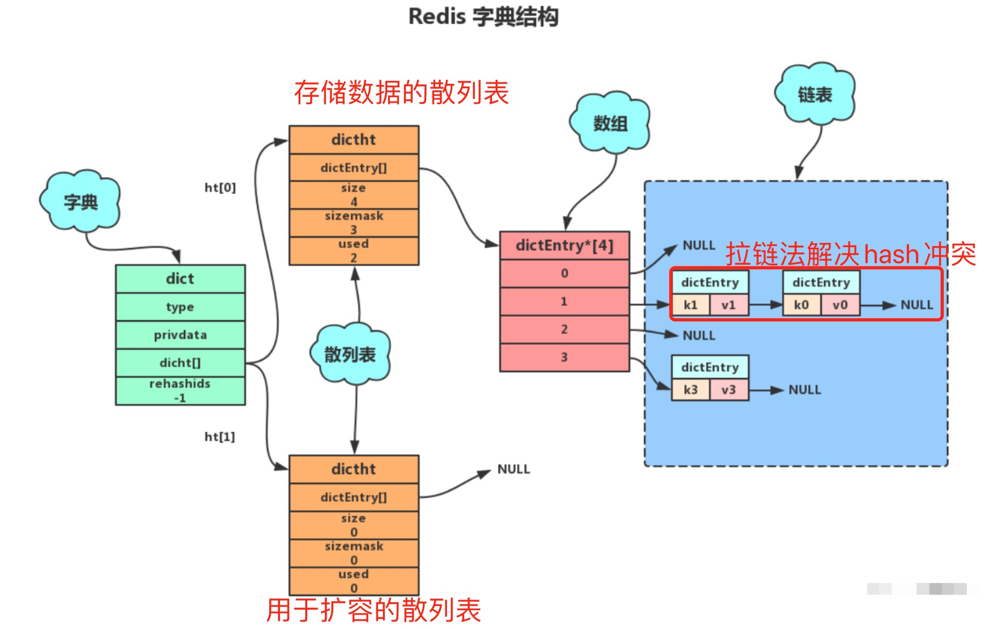
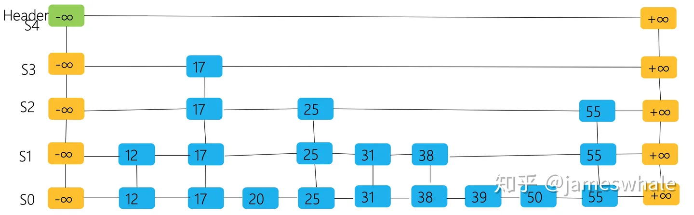
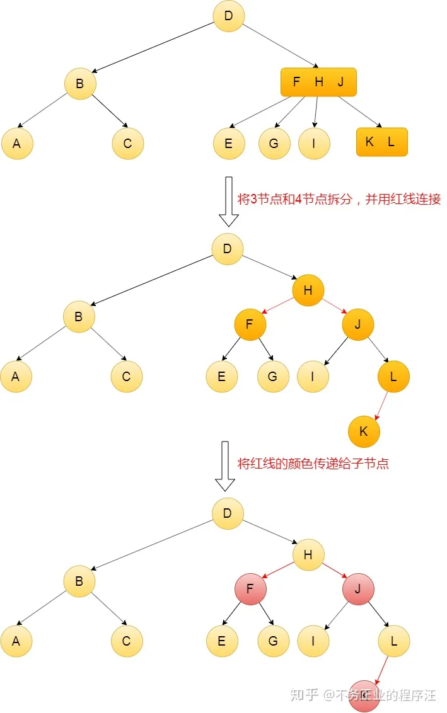
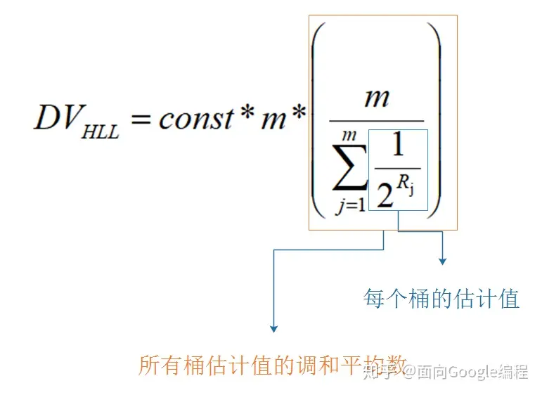
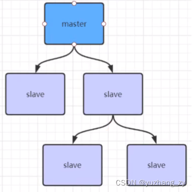

# redis 与传统关系型数据库的区别

# 常用的数据结构

- string

  最常用的单值存储，底层的 RedisObject 有三种 encoding 方式：

  - int

  当 value 为整数且能够被当前操作系统中 C 语言 long 类型所存储的话，那么就会按照 int 的格式存储（long 可能是 32 位也可能是 64 位，取决于 redis 编译时的编译器）。当对 int 编码的值进行修改致使它超过 long 表示的范围后，encoding 就会变成 embstr 或者 raw。

  - embstr

  redisObject 的结构分为【type、encoding、ptr】，当 encoding 为 embstr 时，ptr 存储的是一个 SDS 结构体指针（Simple Dynamic String）简单动态字符串。

  - raw

  当 SDS 的长度超过某个阈值时

  > redis 2.+ --- 32 字节

  > redis 3.0-4.0 --- 39 字节

  > redis 5.0 --- 44 字节

  encoding 会选择 raw，redisObject 底层其实还是 SDS，与 embstr 的区别在于，raw 格式的 object 在创建时，redisObject 结构体和 SDS 结构体是分两次申请内存的，而 embstr 是一次申请。

  embstr 优点在于创建和销毁的时候都只需要操作内存一次，且空间上 object 和 SDS 是连续的，更有利于利用 CPU 缓存。

  缺点在于 embstr 格式的对象是只读的，即如果使用 append 等指令修改其 value 时，底层其实将 encoding 升级为 raw，重新分配 SDS 空间并复制之前的值再做出追加的修改。

  SDS 相较于 C 语言中字符串的优势：

  1. SDS 结构体内部会维护当前字符串的长度 len，使用 strlen 命令获取长度时时间复杂度仅为 O(1)，而 C 语言中仅通过字符串末尾的'\0'来标致结束
  2. 基于 1 中的设计，SDS 的末尾也有一个'\0'，目的是能够复用一部分 string.h 中的库函数
  3. 由于维护了长度 len，SDS 也能存储二进制数据，如图片、音频、视频、压缩文件等
  4. SDS 的 API 非常安全，不用担心对字符串进行操作会造成内存溢出，因为 SDS 的 API 底层会校验剩余可用空间，不够时会进行扩容。

  SDS 的结构体：

  在 redis3.2 版本之前，SDS 的实现还比较简单，内有 len、free、buf 三个元素

  ```c
  struct sdshdr {
      //记录buf数组中已使用字节的数量
      //等于SDS所保存字符串的长度
      unsigned int len;

      //记录buf数组中未使用字节的数量
      unsigned int free;

      //char数组，用于保存字符串
      char buf[];
  };
  ```

  显然，这一版本的实现会有很严重的内存浪费，即非常短的字符串也会在头内用到两个无符号整数来存储（每个 2~4 个字节，取决于编译器），于是 redis 在 3.2 及以后的版本中针对不同长度的字符串，采用了不同的 header：

  根据索要存储字符串的长度，分别采用 1、2、4、8 字节的整型来记录 len 和 buf 的总长度 alloc；采用一个字节的 flag 的低 3 位存储当前 header 采用的字节长度规格（3bit 正好记录 0~7 可以对应 1 到 8 字节）。

  上面四个规格对应 sdshdr8~64，还有个 sdshdr5，这个结构里没有 len 和 alloc，而是使用 flag 的高 5 位来记录 len，不过这个结构只用在了 key 的存储中，而 value 的存储最低只使用了 sdshdr8

  ```c
  // 注意：sdshdr5从未被使用，Redis中只是访问flags。
  /* Note: sdshdr5 is never used, we just access the flags byte directly.
  * However is here to document the layout of type 5 SDS strings. */
  struct __attribute__ ((__packed__)) sdshdr5 {
      unsigned char flags; /* 低3位存储类型, 高5位存储长度 */
      char buf[];
  };
  struct __attribute__ ((__packed__)) sdshdr8 {
      uint8_t len; /* 已使用 */
      uint8_t alloc; /* 总长度，用1字节存储 */
      unsigned char flags; /* 低3位存储类型, 高5位预留 */
      char buf[];
  };
  struct __attribute__ ((__packed__)) sdshdr16 {
      uint16_t len; /* 已使用 */
      uint16_t alloc; /* 总长度，用2字节存储 */
      unsigned char flags; /* 低3位存储类型, 高5位预留 */
      char buf[];
  };
  struct __attribute__ ((__packed__)) sdshdr32 {
      uint32_t len; /* 已使用 */
      uint32_t alloc; /* 总长度，用4字节存储 */
      unsigned char flags; /* 低3位存储类型, 高5位预留 */
      char buf[];
  };
  struct __attribute__ ((__packed__)) sdshdr64 {
      uint64_t len; /* 已使用 */
      uint64_t alloc; /* 总长度，用8字节存储 */
      unsigned char flags; /* 低3位存储类型, 高5位预留 */
      char buf[];
  };
  ```

  注意到上面 struct 声明里的 `__attribute__((__packed__))`，这是在告诉编译器，取消对这个结构体的字节对齐，而是按照实际占用的字节数进行存储，原因是，sds 的指针其实指向的不是结构体的起始地址，而是 buf 的首地址，这是为了让 sds 指针能直接复用 string.h 里的函数；

  如果不进行对齐填充，就能保证 sds 的指针往回退一个字节就能找到 flags 的 8 个 bit，进而根据 header 规格找到 len 和 alloc 的起始位置；相反如果进行了填充对齐，就破坏了这个巧妙地设计。

  > By default, a single Redis string can be a maximum of 512 MB.

  - set key value [EX seconds|PX milliseconds|EXAT timestamp|PXAT milliseconds-timestamp|KEEPTTL] [NX|XX]
  - setnx key value 在老版本 redis 中 setnx 不支持指定过期时间，所以实现分布式锁在加锁的环节需要用 lua 脚本使得 setnx 和 expire 原子地执行。
    > As of Redis version 2.6.12, this command is regarded as deprecated.
    > It can be replaced by SET with the NX argument when migrating or writing new code.
  - get key
  - mget key1 key2 key3 ... 批量获取多个 key
  - mset key1 val1 key2 val2 ... 原子性地批量设置多个 kv
  - msetnx key1 val1 key2 val2 ... 原子性地设置多个 key（当且仅当 key 不存在时才写，不会覆盖）
  - incr key 对于存储整数类型的 key，可以原子性地加 1，注意如果 val 是个浮点数则不能用 incr
  - decr key
  - incrby key intvalue 对于存储整数类型的 key，原子性地增加 intvalue，同样不适用于浮点数
  - decrby
  - incrbyfloat key floatval 可以将整数型的 key 升级成浮点数，此后只能用 incrbyfloat 来修改其值
    如果不进行对齐填充，就能保证 sds 的指针往回退一个字节就能找到 flags 的 8 个 bit，进而根据 header 规格找到 len 和 alloc 的起始位置；相反如果进行了填充对齐，就破坏了这个巧妙的设计。

- list

  线性表结构，按照插入的顺序进行排序，可以用于构建队列/栈的结构，最大存储 2^32 - 1 个元素，即单列表支持存储超过`40亿个数据`。

  list 的数据结构有以下三个阶段：

  - 压缩列表 ziplist （元素数少于 512、每个元素都小于 64 字节） -> 双向链表 list

  - redis3.2 之后 list 底层只使用 quicklist
  - redis7.0 之后 list 底层改用 listpack （这个结构很牛逼 但是 ziplist 和 quicklist 用得太多了 只能慢慢替代）

    - ziplist
      

      entries 占用内存连续，能够更好地利用 CPU 高速缓存。每个 entry 中存储上个 entry 的长度以及当前节点的长度，于是可以根据当前 entry 的指针快速移动到上/下个 entry 的起点。

      相较于链表而言，它能够更高效地利用内存（链表每个节点都要维护两个指针，指针所占字节是很长的，64 位系统一个指针就 8 字节）；但是当所存储元素数量增多后，ziplist 的查询和更新操作效率都很低。

      更致命的是，entry 中的 prelen 在前一个 entry 长度小于 254 时，采用一个字节存储，否则会一下扩大到五个字节（第一个字节固定值为 0xFE，用后面四个字节存储前一个 entry 的字节长度），极端情况下，对 ziplist 中一个元素做出修改使其变长，会导致后面所有节点的 prelen 都发生扩展，极度影响性能。

    - quicklist
      

      quicklist 为了减小 ziplist 产生的连锁更新现象的影响，进行了改造。

      quicklist 可以理解为一个链表，每个节点是一个 ziplist，它严格限制了每个 ziplist 的长度，使其即时发生连锁更新，也不会影响太严重，同时也保证了每一个 ziplist 的查询和更新效率。

      另外，quicklistNode 中 ziplist 还可以采用压缩算法进行压缩，从而生成一个 LZF 结构，node 里的 zl 会指向这个 LZF，进一步压榨内存，提高使用率。

    - listpack
      

    listpack 也是优化 ziplist 后的一种数据结构，它的整体结构与 ziplist 类似，关键在于调整了 entry 内的结构，依次维护

    encoding --- 不同的编码会占 1~5 个字节不等，可以理解为前几个 bit 位用来枚举编码，剩下的比特位用于存储 content 中内容的长度

    data listpack

    slen --- 指的是当前字节对于本 entry 起始地址的偏移量，也是 encoding + content 的总字节长度
    listpack 也是优化 ziplist 后的一种数据结构，它的整体结构与 ziplist 类似，关键在于调整了 entry 内的结构，依次维护

        encoding --- 不同的编码会占1~5个字节不等，可以理解为前几个bit位用来枚举编码，剩下的比特位用于存储content中内容的长度

        data --- 存储本节点中的真实数据。

        slen --- 指的是当前字节对于本entry起始地址的偏移量，也是encoding + content的总字节长度。

        这里的设计非常巧妙，为了能够逆向遍历，需要根据当前节点找到上一个节点的起始位置，在ziplist中就是通过在entry中维护prelen来实现，而listpack中可以直接往前一个字节一个字节地读数据，每一个字节的最高位作为一个标记位，如果为1说明还没读完，如果为0说明已经读取了到了所有记录当前节点slen的字节。

- set

  redis 的 set 底层有两种实现

  - intset

    1. 元素数量小于等于 512
    2. 所有元素都能够被 long long int 类型所存储（如果存不下就会升级成 hashtable 存字符串）

    当满足以上两个条件时，才会用 intset 存储；

    intset 内部维护元素数量、单个元素所占字节数的编码信息 以及存储数据的字节数组。

    contents 内部是一个有序的、元素去重的数组，每次新增元素会将其插入正确的位置（如果发现已经存在则不插入）。

    结构体如下：

    ```c
    #define INTSET_ENC_INT16 (sizeof(int16_t))
    #define INTSET_ENC_INT32 (sizeof(int32_t))
    #define INTSET_ENC_INT64 (sizeof(int64_t))

    typedef struct intset {

            // 编码方式
            uint32_t encoding;  // 默认是INTSET_ENC_INT16 会随着插入元素数值的变大而单向升级

            // 集合包含的元素数量
            uint32_t length;

            // 保存元素的数组          contents最小单元是一个字节，但具体一个元素所占的字节数取决于encoding的值
            int8_t contents[];

    } intset;
    ```

  - hashtable （dict/字典 说的都是这个）

    当 set 中元素不满足 intset 时，就会切换为 hashtable（不会再往回变成 intset）。

    hashtable 的结构体如下：

    > 注意到 dict 中的 ht 是有两个 dictht 元素的数组，其中第二个是在发生扩容的时候用于渐进式扩容用到的。

    ```c
    // 字典
    typedef struct dict {
        // 指向 dictType 结构的指针（dictType 结构保存的是操作特定类型键值对的函数）
        dictType *type;
        // 保存上述所说函数的参数
        void *privdata;
        // 哈希表
        dictht ht[2];
        // rehash 索引，rehash 不进行时值为 -1
        long rehashidx; /* rehashing not in progress if rehashidx == -1 */
        // 正在运行的迭代器数量
        int iterators; /* number of iterators currently running */
    } dict;

    // 哈希表 （相当于桶数组）
    typedef struct dictht {
            //哈希表数组
            dictEntry **table;
            //哈希表大小
            unsigned long size;
            //哈希表大小掩码，用于计算索引值
            unsigned long sizemask;
            //该哈希已有节点的数量
            unsigned long used;
    }dictht;

    //哈希表节点定义dictEntry结构表示，每个dictEntry结构都保存着一个键值对。（相当于桶里的链表节点）
    typedef struct dictEntry {
            //键
            void *key;
            //值
            union{
            void *val;
                uint64_tu64;
                int64_ts64;
                }v;
            // 指向下个哈希表节点，形成链表
            struct dictEntry *next;
    }dictEntry;

    ```

    

- zset

  zset 是维护着元素 score 值排序的 set。

  所以它的实现有两部分：

  1. 实现 set --- 这部分使用 hashtable/dict/字典 用于快速在 zset 中查找一个 key
  2. 实现 score 的排序 --- 这部分使用 ziplist 和 skiplist 用于维护 score 的顺序结构

  redis 对内存利用的优化非常极致，有很多数据结构都是在数据规模小的时候极致利用内存而忽略时间复杂度；zset 的 ziplist 就是处于这样的考虑。

  - ziplist
    当满足「元素数少于 128、每个元素都小于 64 字节」时，zset 底层就用 ziplist 存储，其中每两个相邻的元素存储的是 value 和 score。
  - skiplist

    跳表是面试中问到最多的数据结构，个人理解它的演化路径是这样的：维护一个有序的线性表，最简单的就是数组和链表；数组的插入效率低，链表的查询效率低。

    跳表其本质就是一个加上了索引结构的链表，目的是赋予链表进行二分查找的能力。

    可以这样描述一个跳表的结构：最低层是一个链表，而每一个节点中维护的不是一个 next 指针，而是 32 个 next 指针，每一个元素一定会出现在第 0 层链表中，又有 1/2 的概率出现在第 1 层链表中，依次类推，一个元素最高可能出现在第 31 层的链表中。skiplist 中会维护所有节点中所出现的最高的层数，同时维护这 32 个链表的头结点地址。

    跳表的查询过程如下：

    从最高层数的链表头结点开始遍历，如果找到了目标值的元素则返回；如果找到第一个大于目标值的元素，那么继续遍历前一个节点低一层级的 next 指针对应的节点；如果走到当前层级最后一个元素，发现它还是比目标值小，那么继续遍历它下一层级 next 指针对应的节点；如果走到第 0 层了且当前节点值大于目标值，说明目标元素不存在。

    跳表非常巧妙的设计在于，并不是强制规定哪些节点会存在于哪一层的链表中，而是通过概率的方式，来保证约有 1/2 的元素在第 1 层，1/4 的元素在第 2 层...如此保证整体查询的复杂度近似于 O(logn)。
    

    通常会将 skiplist 与红黑树进行比较，skiplist 的查询、删除、新增时间复杂度都是 O(logN)，但由于节点层高是基于概率得来，可能在极端情况下，一直删除高层/底层节点，就会导致所有节点都位于底层/高层，进而查询效率会下降为 O(N)。而红黑树的查询效率稳定为 O(logN),它也能进行顺序遍历（中序遍历树），但是不支持范围查询。

    红黑树是一种改进之后的自平衡二叉查找树（每一个节点的左右子树高度差不超过 1，控制高度，保证查找效率）。它的性质如下：

    1. 根节点为黑色，所有红色节点的子节点一定是黑色节点（如果它有子节点的话）。
    2. 满足 AVL 树的所有性质（左右子树高度差不超过 1，左子比根小，右子比根大）。

    只要保证在插入和删除的过程中，一直维护上述性质，那它就是一棵红黑树。基于红黑树的颜色信息，还会有以下结论：

    从某个非叶子结点出发，它所到达所有叶子结点的路径中的黑色节点数量一定是一样的。

    这一个性质可以保证从一个节点出发，到达所有叶子结点的路径中，最长的长度不会超过最短的的两倍，进而保证红黑树在最差情况下的时间复杂度也能保持在 O(logN)。

    这里总结一下树形结构：

    1. 二叉树 --- 一个节点两个子节点，没有顺序关系。
    2. 二叉查找树 BST --- 左子节点比根节点小，右子节点比根节点大；极端情况下会退化成链表，查询效率低。
    3. 自平衡 --- 能够在插入/删除过程中维护左右子树高度平衡的 BST，但只是一个概念。
    4. AVL 树 --- 这是 1962 年两个苏联人发明的自平衡二叉树，俩人名字是 G. M. Adelson-Velsky 和 E. M. Landis，以他们名字命名了 AVL 树。在插入/删除时，会基于左右旋转的动作维护树的高度平衡。
    5. 2-3 树 --- 在自平衡的基础上，一个非叶子节点内可以有 1 个或两个数据，对应有 2 个或 3 个子树。
    6. 2-3-4 树 --- 一个非叶子结点内可以有 1 个或 2 个或 3 个数据，对应有 2 个或 3 个或 4 个子树。
    7. B 树 --- 其实 B 树就是一个拓展的 2-3-4 树，如果 degree 为 3，那么一个节点最多有 3 个子节点，这符合 2-3 树的定义；degree 为 4，那就是 2-3-4 树。
    8. B+树 --- B 树无法顺序遍历，于是有了 B+树，B+树的构建过程可以理解为给一个链表添加索引（链表一个节点中可以有一组数据），一层一层向上堆叠，形成了 B+树。它可以通过 O(logN)的时间复杂度查询一个元素，也可以在到达叶子节点之后横向地遍历，以达到范围查询的效果。
    9. 红黑树 --- 其实红黑树就是 2-3-4 树的变体，将 2-3-4 树的含有 2 个和 3 个元素的节点进行拆分，再将拆分后的线所连接的子节点变成红色，就变成红黑树了。
       

- hash

  哈希表的底层数据结构有两种：

  1. 当元素数少于 512、每个元素都小于 64 字节时，使用 ziplist
  2. 当不满足上述条件时，转换为 hashtable(dict/字典)

  当使用 hashtable 时，会根据负载因子（存储元素数量/桶数）进行扩容/缩容：

  1. 小于 1 时不进行扩容
  2. 大于 1 小于 5 时，如果此时 reids 没有在执行 bgsave 和 bgrewrite 时，也会进行扩容
  3. 大于 5 时，不管是否在执行 bgsave 和 bgrewrite，都会扩容
  4. 当小于 0.1 时，就会进行缩容。

  具体地，当触发扩容时，dict 中的 ht[1]会申请 ht[0]两倍的空间，然后开始渐进式的扩容（整个过程又被称为 rehash），当 map 发生增删改查时，都会触发 rehash，dict 中的 rehashindex 会记录当前迁移桶的 index（不迁移时为-1），每次 rehash 都会把 ht[0]中的一个桶里的元素存到 ht[1]中再清空当前桶；在迁移过程中新增的 key，会直接写入 ht[1]，查询 key 时会先在 ht[0]中找，找不到就去 ht[1]里找。当 rehashindex 达到 ht[0].size 时，说明迁移完了，于是会将 dict[0]重新设置为 dict[1]，而 dict[1]设置为 null。

  > 为什么扩容会有两种条件呢？

  1. bgsave： fork 一个子进程将当前内存快照写入 rdb 文件
  2. bgrewrite：fork 一个子进程将当前的 aof 文件进行重写（对其进行体积优化）

  这两个操作都会先 fork 一个子进程，这里面有一个 COW（copy on write）技术，它说的是对于 linux 系统而言，fork 出来的子进程并不会从一开始就复制父进程的整个内存空间，而是将父进程的内存空间设置为只读，然后父子进程共享内存空间；当父进程或子进程对内存中的某个页进行写操作时，就会触发一个页异常中断，于是将本页复制一份供由本进程专门使用；即延迟复制发生的时间，且仅复制那些双方不一样的数据。

  在 bgsave 和 bgrewrite 正在进行时，为了尽可能减少父进程内存的写操作从而提升 cow 的性能，才会在这里将 dict 扩容的阈值上调到 5。

  cow 本质上就是一种延迟复制的思想，在对共享资源进行读多写少的访问时，也会用到：如果对共享资源加读写锁，而写操作实际上非常少，那么在所哟的读操作之前都要加锁，开销其实很大，于是可以引入 cow 机制，让读操作不加锁，而写操作加锁，并且在写操作发生时将共享资源复制一份后再进行修改，释放锁时再将原资源的指针指向修改之后的资源。如此可以保证并发的读请求和写请求之间数据隔离（java 中的 CopyOnWriteArrayList）。

- hyperloglog

  hyperloglog 是一种近似算法，常用作不精确的去重数量统计，考虑下面的场景：

  业务需要统计某个页面的 PV 和 UV

  - 其中 PV 可以以页面 id 为 key，访问数量作为 value，每多一次访问则 incr key 即可，对于简单的 kv 类型，如果 value 能够被 long 所存储，就只会占用 4 个或 8 个字节，不用考虑内存问题；
  - 但对于 UV 来说，需要以 user_id 去重后计数，那么可以采用 set 类型来存储，假设 user_id 是一个长度为 36 的字符串；set 对于字符串类型采用 dict 存储，一个 user_id 至少要占用 36 字节（还要考虑 dict 中其他字段、指针的大小），当用户数量为 100W 时，一个页面的 UV 统计就至多要花掉 1,000,000 \* 36 byte = 36MB，若需要进行 UV 统计的页面增多、用户增多，这个内存开销是直线增加的。

  另一方面，UV 统计往往不需要精确到个位，100 万和 101 万 UV 在展示效果上没有太大区别，于是就可以使用 hyperloglog 进行非精确的去重统计。

  原理如下：

  考虑抛硬币的场景，每一次的结果要么正面要么反面，概率都为 1/2。

  现规定从第一次抛硬币开始，如果遇到正面则记录出现正面的次数并继续，遇到反面则停止，此为一轮。

  如果我在很多轮尝试后，连续出现正面的计数最大值为 10，那就可以估算我大概进行了 2^10 = 1024 轮尝试。因为如果我连续抛 10 次，每一次都是正面朝上，这件事发生的概率就是（1/2）^10 ≈ 0.0976%，理论上说，我得尝试 1 / 0.0976% = 1024 轮才会出现一次。

  可是万一我运气就有这么好，第一轮尝试就出来连续 10 个正面怎么办呢？那么可以同时多找些人来抛硬币，总不可能所有人运气都这么好吧？于是将 m 个人在若干轮中抛出来连续正面的次数 ki 求调和平均数后取倒数即可得到排除好运气之后，每个人所连续抛出正面的最大次数 n，于是每个人尝试的轮数大约为 2^n，所有人共进行 m \* 2^n 次尝试。

  hyperloglog 就是利用这个原理，对所有 key 分别计算哈希，对于每一个哈希值，取其最低 n 个 bit 进行桶编号映射称为 HLL 的精度，精度越高估算误差越小，空间开销也越大），剩余的 bit 从高往低排列，计算其中 1 第一次出现的位置，如果它大于桶中的值则更新。

  如此 HHL(10)总共有 2^10=1024 个桶，对每个桶记录的最大的首次 1 出现的位置取调和平均数，再取倒数得到 n，那么每个桶预估的不同 key 数量为 2^n，于是 m 个桶总共预估不同 key 数量为 m \* 2^n。
  除此之外还会有一个基于桶数量 m 的修正系数 const。

  HLL 加入新元素的时间复杂度为 O(1)，整体空间复杂度仅与精度 m 和基数 N 有关，而与需要去重的整体 key 数量 n 无关，其值值为 O(mlog(logN)),换句话说，当精度 m 固定、整体基数（所有元素中不同元素的个数）不变时，需要去重的元素总体数量不影响存储空间。
  

  具体 redis 执行：

  - pfadd 向 hll 中添加一个 key
  - pfcount 统计当前 hll 中的去重元素数量（基数）
  - pfmerge destKey sourceKey1 sourceKey2... 合并多个 hll

- bitmap

  bitmap 本质上就是一个 string 类型的 kv，我们利用 string 底层每一个字节中的一个 bit 位来存储信息。

  适用于需要存储海量数据的 0/1 两个状态的场景（当然，如果状态基数较小，如 3~4 种状态也可以利用 bitmap 中连续的两个 bit 来存储）。

  redis 指令：

  - setbit key offset val
  - getbit key offset

  经典使用场景：用户每日打卡、签到记录、布隆过滤器

  这里提一下布隆过滤器，它的原理是将需要加入的 key 分别进行多次哈希计算，每次的哈希值为 1 的 bit 记录到一个很长的 bitmap 中；如果一个 key 的哈希值中为 1 的 bit 在 bitmap 中为 0，说明这个 key 肯定不曾被加入过；但是即使一个 key 所有哈希值的 bit 在 bitmap 中全都为 1，它也不一定绝对加入过。

  布隆过滤器仅支持插入和查询，而不支持删除；于是有 counting bloom filter 来对每个 bit 位进行计数从而支持删除，不过会引入非常大的内存浪费。

  另外还有布谷鸟过滤器，采用「鸠占鹊巢」的思想，对于一个待插入的 key，布谷鸟过滤器会计算它的指纹 fp，然后通过一个特殊的哈希函数计算出 p1 = hash(fp)，这个哈希函数的巧妙之处在于可以在不知道 fp 值得情况下通过 p1 XOR hash(fp) 就能计算出 p2。于是对于一个 key，它会有 p1 和 p2 两个可用槽位，当其中任意一个为空时，就可以占用并把 fp 存下来；如果全都已经有 fp 了，就会挑一个「鸠占鹊巢」，通过该位置的 p 和其中存储的 fp，计算出被赶出去的鸟的另一个巢，如果另一个巢也被占了，则重复这个挤兑过程。当一个 key 插入导致的挤兑次数超限，则会触发布谷鸟过滤器的扩容。

- bitfield

  redis 支持通过 bitfield 对一个 string 类型的 key 做 bit 级别的读、写、incr。

  例：

  ```json
  127.0.0.1:6378> set s a   // 存出字符串"a" 占一个字节，存储ASIIC码 96 0b0110 0000
  OK
  127.0.0.1:6378> bitfield s get u8 0 // 在s底层的bit偏移量为0的地方 以无符号整数(u)的方式读取8个bit
  1) (integer) 97
  127.0.0.1:6378> bitfield s incrby u8 0 1    // 在s底层的bit偏移量为0的地方 把8个比特当成一个无符号整数，并给它加1
  1) (integer) 98
  127.0.0.1:6378> get s
  "b"
  127.0.0.1:6378> bitfield s set u8 0 99 // 在s底层的bit偏移量为0的地方 将99的低8bit写入 0b0110 0011
  1) (integer) 98
  127.0.0.1:6378> get s
  "c"
  127.0.0.1:6378>
  ```

- stream

  这是 redis5.0 以后新增的数据结构，可以用它来实现一个非常轻量级的消息队列，它支持消息的持久化、消费者组、消费确认等机制。

  实体概念：

  stream --- 可以理解为 topic。

  group --- 消费者组，一个 group 里可以有多个 consumer。对同一个 stream 的不同 group 之间相互独立，各自读取消息的进度互不影响。

  consumer --- 一个 group 里可以有多个 consumer，组内的 consumer 只能互斥地消费 group 里的消息（在 block 模式下，应该有负载均衡算法来分配消息）。

  redis 指令：

  - XADD key [NOMKSTREAM] [MAXLEN|MINID [=|~] threshold [LIMIT count]] \*|ID field value [field value ...] 创建 stream

    - [NOMKSTREAM] - 当 key 不存在时，不要自动创建这个 stream
    - [MAXLEN] - 指定 topic 里能存储的最多消息数，默认不限制。
    - [MINID] - 指定插入时的最小 id，如果本次要插入数据的 id 小于该值，则插入不成功。（消息 id 默认分为 时间戳-毫秒内消息序号 两部分，比较大小时分开比较，当 id 中没有-时，会认为时间戳部分数值为 0）
    - [LIMIT count] - 限制 stream 的元素数量不超过 count，如果本次 xadd 会导致元素数量超过，则会将队列头部的元素踢出去。

  - XGROUP CREATE key groupName [start] 创建消费者组

    - [start] 有几种形式
      - ① 0-0 表示从头开始消费 (其实语义是从大于 0-0 这个 id 开始的消息开始消费)
      - ② $ 表示从 stream 的下一条消息开始消费（忽略掉此时 stream 里已经有的所有消息）
      - ③ 具体某一个消息 id 表示从该消息之后的第一条消息开始消费

  - XREADGROUP GROUP groupName consumerName COUNT n [BLOCK milliseconds] [NOACK] STREAMS key [start] 从消费者组中消费
    - 这里的 consumerName 会自动创建对应的消费者，具体的消费者管理操作是 XGROUP CREATECONSUMER / DELCONSUMER
    - BLOCK 可以指定阻塞式读取，milliseconds 为 0 时表示永久阻塞等待
    - NOACK **注意** 这里的 NOACK 指的是「不用手动 ACK」，即自动 ACK，默认不声明 NOACK 时是需要手动 ACK 的，注意仅在使用>读取最新消息时NOACK才会生效，如果是用0-0或具体id去读pending列表里的消息，NOACK是没用的。
    - [start] 有几种形式 - ① > 表示读取本消费者组中下一个可以消费的消息 - ② 0-0 表示读取本消费者组的 pending 列表里，第一个消息开始消费 - ③ 具体某一个消息 id 表示从 pending 列表里该消息之后的第一条消息开始消费
      > （注意 只有>才能读到最新的消息 指定消息 id 时只会从 pending 列表里返回）
  - XACK key groupName messageId

    消费者组消息确认，会将该消息从该 consumer 的 pending 列表移除，此后该消费者组中的消费者就无法再读取这条消息了。

  - XPENDING key groupName start end count [consumer]

    查看消费者组（或某个具体消费者）的 pending 列表

    常用参数: XPENDING key groupName - + count [consumer] 查看所有的 pending 消息

- geospatial

  这是 redis 内部用于存储经纬度的数据结构，它能够支持基于一个经纬坐标或者一个地点元素的范围查找（圆形区域）。

  redis 的 geospatial 的底层其实就是一个 zset，其中的 score 是元素经纬度的 geohash 值（撮合之后的 bit 转成整数）。

  geohash 的思想大致如下：

  将整个地球平铺开，对经度进行二分，如果当前元素的经度位于左边则编码为 0，否则编码为 1；之后对于它所在的那半边继续二分，重复以上过程，就可以得到经度的一连串二进制编码，由它可以确定一个唯一的经度，而随着 geohash 的长度增长，这个精确值与当前元素的经度就会越接近（geohash 为 8 位时，误差可以缩小到 20 米以内）。

  维度编码的计算与精度编码几乎一样。

  得到经纬编码之后，将它们撮合在一起：经度占偶数位，维度占奇数位，最后的结果经过 base32 编码就得到最终的 geohash 值。公共前缀越长的两个 geohash，它们在物理上的距离就越近

  常用命令：

  - GEOADD key [NX|XX] [CH] longitude latitude member 添加元素 其中 member 相当于 zset 中的 value
  - GEODIST key member1 member2 [m|km|ft|mi] 计算两个地点的距离 可以指定单位
  - GEOPOS key member 查询一个地点的经纬度
  - GEORADIUS key longitude latitude radiusValue m|km|ft|mi [WITHCOORD] [WITHDIST] [WITHHASH] [COUNT count] [ASC|DESC] 查询指定经纬度的指定圆形范围内的元素，可以选择性地返回其经纬度、距离、geohash 值，还可以指定根据距离升序/降序排序。
  - GEORADIUSBYMEMBER key member radius m|km|ft|mi [WITHCOORD] [WITHDIST] [WITHHASH] [COUNT count [ANY]] [ASC|DESC] 查询指定元素指定圆形范围内的元素（会返回它自己）

  可以用作距离计算、附近的人、POI 推荐等等功能。

# 内存清除策略

redis 是一个基于内存的 k-v 数据库，它的持久化策略更偏向于用于数据的恢复，而不是像 innodb 那样用于检索，于是当 redis 进程所分配的内存空间不够用时，它不能将一部分数据持久化到磁盘以腾出内存空间，所以需要引入内存清除策略。

redis 中的策略完整有八种：

1. noeviction --- 不清除策略，当新的写请求到来时，只会去执行那些能让内存占用减少的指令（例如 del 和其他的删除类操作），其他的则返回内存不足的错误从而拒绝写入
2. volatile-lru --- 针对那些设置了过期时间的 key，使用 lru 算法，移除那些最后一次使用时间最远的 key；least recently used 最少最近使用。
3. allkeys-lru --- 针对所有的 key，使用 lru 算法淘汰
4. volatile-lfu --- 针对那些设置了过期时间的 key，使用 lfu 算法，移除那些一段时间内使用频率最低的 key；least frequently used 最少频率使用。
5. allkeys-lfu --- 针对所有的 key，使用 lfu 算法淘汰
6. volatile-ttl --- 针对那些设置了过期时间的 key，把那些距离过期时间最近的 key 移除。
7. volatile-random --- 针对那些设置了过期时间的 key，随机删除
8. allkeys-random --- 针对所有 key，随机删除

如果业务缓存数据真的数量庞大以至于会占满 redis 内存，那就应该考虑使用 redis 集群架构对数据进行分片存储，尽量避免驱逐策略的使用。

实际生产中，不应当把 redis 当做一个可靠的持久化存储设备，而应该是一个为数据库分担压力的缓存层，以保证业务在某些 key 被驱逐时的正确运行。

开启方式： 配置文件中设置 maxmenmory 和 maxmemory-policy，另外 mapmemory-samples [count]是在 lru 和 ttl 的驱逐策略下，会随机去待淘汰队列选取的 key 数量，在这随机捞出来的数据里选最应该被淘汰的，该数值默认是 5，当设置为 10 时基本就趋近于精确的 lru 和 ttl，但是会消耗更多的 cpu 资源。 由此可见，redis 内存驱逐策略中的 lru 和 ttl 都是近似的，而不是完全精确的。

# key 过期策略

redis 中的 key 通过时间戳的方式实现过期，对过期 key 的删除采用的是定时随机检测和惰性删除。

惰性删除指的是，当读取一个 key 的时候，redis 会检查其过期时间与当前系统的时间戳，如果过期则删除它。注意这里的读取指的不仅仅是 get 操作，其他的诸如 setnx 也会先检查 key 是否存在或是否过期。

定期随机检测指的是，redis 每隔一段时间就在库中的设置了过期时间的 key 里随机抽取一部分，如果他们过期则删除。如果一轮检查下来发现过期 key 的比例超过一定数值，就会重复该过程，直到过期率下降或者本次检查时间达到上限才停止。

另外，过期 key 对 RDB 和 AOF 的影响：

- 当 RDB 发生时，会检查 key 是否过期，如果过期则不会写入 RDB 文件中。
- 当从 RDB 恢复数据到内存时，也会检查 key 是否过期，过期的不会加载。

- 当 AOF 发生时，那些已经过期了但还没被从内存中删除的 key 没有被访问，是不会被写入 aof 文件的；
- 如果在 AOF 发生前这段时间，redis 将过期 key 从内存里删除了，则会往 AOF 里写一个 del 操作，于是通过 AOF 恢复内存数据时这个过期 key 就会被删掉。
- AOF 发生重写时（bgrewrite），那些过期了的 key 则不会写入 aof 文件，以此对 aof 文件进行优化压缩。

# 持久化策略

redis 有两种持久化机制：

- RDB (Redis DataBase)

  redis 默认开启 RDB，可以通过 redis.conf 配置其触发时机：

  ```shell
  操作次数越多，触发持久化的时间间隔就越短（防止数据丢失） ，我们可以通过修改redis.conf文件，来设置RDB策略的触发条件。

  # rdb持久化策略开关
  rdbcompression yes

  # 配置rdb持久化策略
  save 900 1  # 每900秒 有1次写操作就触发一次RDB
  save 300 10  # 每300秒 有10次写操作就触发一次RDB
  save 60 10000  # 每60秒 有10000次写操作就触发一次RDB
  ```

  - 优点：内存快照，且有压缩机制，导出的 rdb 文件相对 aof 来说更小，恢复数据时更快；适合对内存数据全量持久化。
  - 缺点：如果通过 save 命令会阻塞当前线程造成 redis 不可用，采用 bgsave 会 fork 子进程来进行写文件（利用 cow 机制，父子进程共享内存空间），当内存数据很多时，子进程可能执行很久，其内存和 CPU 占用必然影响父进程，可能导致 redis 卡顿。不适合做实时的数据持久化。

- AOF (Append Only File)

  redis 默认关闭 aof，可以通过 redis.conf 中的`appendonly true`来开启。

  aof 指的是将每一条写操作都追加到 aof 文件中，具体地，aof 文件中存储的是 RESP 协议格式的命令，例如：

  ```go
  set name grorgayang
  # resp协议每一部分的结尾都是\r\n
  *3      // 完整的指令是有3个元素的数组
  $3
  set   // 第一部分有三个字符
  $4
  name  // 第二部分4个字符
  $10
  georgayang // 第三部分10个字符

  则rdb中会存储一行：

  *3\r\n$3\r\nset\r\n$4\r\nname\r\n$10\r\ngeorgayang\r\n
  ```

  可以通过 redis.conf 中的`auto-aof-rewrite-min-size 64mb`来设置自动触发 aof 文件重写的文件大小

  也可以通过`auto-aof-rewrite-percentage 100`来设置距离上一次重写之后文件大小增长百分比 达到后再次重写

  当使用 bgrewrite 进行 aof 重写时，redis 会将操作进行合并（如果可以的话），只保留那些能够将内存恢复的最少指令集合，例如客户端连续一百次 incr counter，那就可以合并成 incrby counter 100。

  可以通过设置 appendfsync 属性来指定触发频率：

  - always --- 每次写操作都会追加到 aof 文件中
  - everysec --- 每秒钟进行一次 aof（默认）
  - no --- 将 aof 内容写入缓冲区，刷盘的时机交给操作系统来决定

  这里提一下操作系统刷盘策略：

  当 Redis 将数据写入 AOF 缓冲区时，数据实际上是写入了操作系统的页缓存中。操作系统会在一定的条件下将缓存中的数据刷到磁盘中，这些条件包括：

  - 时间条件：操作系统会定期将缓存中的数据刷到磁盘中，以确保数据的持久性和一致性。
  - 空间条件：当缓存中的数据达到一定大小时，操作系统会将其中一部分数据刷到磁盘中，以释放缓存空间。
  - 手动触发：通过调用 sync()或 fsync()等系统调用，可以手动触发将缓存中的数据刷到磁盘中。

- 混合持久化

  在 redis4.0 中支持通过 redis.conf 中的`aof-use-rdb-preamble yes`来开启混合持久化，其底层是会在 rewrite 发生时，先取当前内存快照按照 rdb 格式写入新的 aof 文件中，并将此期间主线程的写指令转换成 RESP 协议格式写到 aof 文件里。相当于混合持久化的 aof 文件中由 rdb 内存快照 + aof 日志 两部分构成。在通过 aof 文件恢复内存时，就会先读取 rdb 部分的数据，再重放 aof 部分。

# 主从同步原理

# 哨兵模式

# 集群模式

# 分布式锁

## 与用数据库实现、zookeeper、etcd 的异同

# 分布式信号量

# 单线程还是多线程？

- 在 redis6.0 之前，「单线程」指的是处理网络请求、执行指令都是单线程的。
- 在 redis6.0 之后，网络请求模块也引入了多线程，「单线程」指的仅仅是指令执行。
- 除了网络请求(redis6.0 之前)和指令执行是单线程模型的，其他的诸如持久化、主从同步等模块都是多线程处理的。

# 为什么快？

1. 基于内存的数据存储，相较于传统关系型数据库进行磁盘 I/O 的开销，快了很多个数量级。
2. 命令执行仅由一个线程实现，避免了单核场景下的线程上下文切换带来的开销。
3. 基于 linux 的 epoll 来实现网络处理模块，其多路复用的机制提升了网络 I/O 效率。
4. redis 底层采用了非常高效的数据结构对数据进行存储，在内存开销和时间开销上做到了较高的平衡。

# I/O 多路复用

广义上来说指的是一个线程能够监听多个文件描述符（socket 本质上也是一个文件描述符，在 epoll 中有可读、可写、就绪三个状态）的可读/可写状态

在我们编写 tcp 服务器的时候，每创建一个 socket，就起一个新线程来处理 socket 数据的读写，这就会导致连接数增多之后要创建大量线程，收到服务器内存和进程打开最大文件描述符的限制。

I/O 多路复用就是利用操作系统底层 I/O 模型提供的系统调用，让一个线程监听多个 socket 的 I/O 事件。

- select

  select 中定义了三种文件描述符：readfd、writefd、exceptfd，分别对应 fd 的读、写、异常事件。

  select 的接口定义：

  ```c++
  int select(int nfds, fd_set *readfds, fd_set *writefds, d_set *exceptfds, struct timeval *timeout);
  ```

  简单理解就是，现在有 10 个 socket 连接的文件描述符，如果想要从他们里面读数据，就可以遍历它们通过 FD_SET()函数把每一个文件描述符填到 readfds 这个位图里去，然后调用 select，在最多阻塞 timeout 时间后，会返回三种值：

  - 没有任何一个文件描述符有事件发生 --- 0
  - 调用失败 --- -1
  - 至少有一个文件描述符有事件发生 --- timeout 剩下的时间

  业务拿到 select 的返回之后，如果返回值大于 0，则可以去遍历 readfds 这个位图，那些为 0 的是没有发生事件的，而为 1 的则是对应的文件描述符发生了事件。

  也就是说，在使用 select 时，拿到返回之后还要进行一轮 for 循环去遍历所有文件描述符，才能知道哪些发生了事件。

  另外，select 入参的三个位图，最多只能接受 1024 个文件描述符，换言之超过 1024 的 tcp 连接就不能使用 select 来多路复用了；

  select 的时效只有一轮，业务需要在循环里不断构造位图参数，并调用 select。

- poll

  poll 是对 select 的不彻底的改造优化，它解决了文件描述 1024 个的数量限制问题，能够监听更多 socket 连接。

  但是其底层还是在每一次调用时都需要将文件描述符列表从用户态拷贝到内核态，存在性能上的问题。

  ```c++
  int poll(struct pollfd* fds, nfds_t nfds, int timeout);
  ```

- epoll

  这是 linux2.6 版本内核基于时间通知机制实现的 I/O 多路复用模型，它没有文件描述符的数量限制，支持一个线程管理 100 万个并发连接。

  - 更快的 I/O 进行队列：在内核空间中维护了一个红黑树和一个链表来记录所有的 epoll 对象、事件。并且采用了回调函数直接把满足条件的事件进行处理，避免了轮询或者遍历整个数据结构的过程，从而避免不必要的计算和拷贝开销，提高了效率。
  - 较少的内核内存拷贝：epoll 底层支持零拷贝，只有在数据报已经就绪时，才将数据从内核缓冲区拷贝到用户空间，在应用程序中避免了多次的内核-用户态间的内存拷贝，提高了效率。
  - 支持两种工作方式：边缘触发（Edge-Triggered，简称 ET）和水平触发（Level-Triggered，简称 LT），这意味着 epoll 既支持阻塞（Block）工作方式，也支持非阻塞（Non-Block）工作方式。
  - 使用简单：只有三个 API 函数 - epollcreate、epollctl 和 epoll_wait，并且与 select 和 poll 类似，为开发人员提供了一致的使用方式和语法。

# redis主从切换导致缓存雪崩

当从节点机器时钟远快于主节点时，发生主从切换，那些在原本主节点上还没过期的key，会被新主节点认为已经过期了，从而在短时间内大量删除key，造成缓存雪崩。

根本原因是redis的过期不是基于定时器的，而是基于毫秒级的时间戳+懒删除+定期删除策略，强依赖于系统时钟。

# 主从复制风暴

当主从架构中的从节点过多，且从节点同时连接主节点，这时候要进行全量复制，主节点会把当前的rdb文件发给所有的从节点，会给主节点带来很高的瞬时压力，于是可以采用级联结构，让一部分从节点充当次级主节点，让剩下的从节点来同步这些次级主节点。



# 分布式锁丢失

在redis主从架构下，由于是异步复制，当业务在主节点加锁成功后，从节点可能还没有加锁成功，此时主节点故障进而发生主从切换，此时从节点上就没有这把锁的信息。

# redlock

redlock是redis作者为了解决主从架构下锁丢失而提出的一种分布式锁解决方案，它的大致思想是：

1. redlock由 2*n + 1个redis实例构成，所有实例之间完全独立，没有任何数据同步的逻辑。
2. 客户端通过redlock加锁时，redlock会向所有redis实例发起setnx请求，当且仅当超过半数的实例节点返回成功时，才认为加锁成功，否则认为加锁失败并再次向所有节点发送del请求。
3. 对于客户端来说，锁的真实有效时间是 申请时间 - redlock请求加锁的事件

存在的问题：
如果要保证节点宕机重启后本机的锁不丢失，可以开启aof并让其触发条件设置为always（性能影响很大，且aof是后写日志，即使开启了always的策略也有可能丢数据）；也可以无脑堆机器，增多redis的实例数量，只要机器足够多，那么n+1台机器同时宕机并重启丢失锁key的概率就无限趋近于0。

综合来看，redis自身的定位就是一个AP模型的缓存中间件，高可用是它的特性，而多节点时的强一致性并不能得到很好的保证。如果业务的并发量真有那么大，且数据强一致性要求真的那么高，那就应该抛弃redis分布式锁，转而使用zookeeper、etcd等CP模型的中间件来实现分布式锁。


#  雪崩、击穿、穿透
- 雪崩
    - 强调的是大批key同时过期，进而查询流量涌入db，给db带来瞬时的巨大压力进而触发系统熔断机制或者宕机，进而导致整个系统的业务不可用。
    - 当系统批量写入大批key时，可以给过期时间增加一定的随机偏移量，避免大批数据同一时刻过期。
    - 双key策略，主key设置过期时间，备key永远有效，当业务请求主key发现过期时，则返回备key的值，然后异步地查询db更新双key，避免瞬时因为主key不命中而产生的读流量打到db。（二级缓存）

- 击穿
    - 强调的是对于单一热点key的访问，缓存刚好过期，那么所有的读请求都会去读db导致压力增大。
    - 这里其实还有个热key重建问题，当并发的读请求都去查询db拿到数据之后，又会重复地构建缓存，浪费redis的性能。
    - 可以考虑对热点key构建二级缓存，避免突发流量直接打到db；另一方面，可以在业务读缓存失败之后，随机sleep短暂时间后再次重试，只让睡得最少的那一个线程去查db和构建缓存（热key重建、Double Check Lock）；另外可以对热点key引入续命机制，在短时间内会大量访问到的key就不应该自动过期。
- 穿透
    - 强调系统中涌入大量db里根本不存在数据的查询，这里有两种可能：
    - 请求来自于业务本身，这就属于业务上没有保证数据完整性，db数据被删了但是还有依赖该数据的地方，需要调整修正业务逻辑；可以对db中不存在的值做空key缓存。
    - 请求全是随机的不存在数据，属于服务接口被恶意攻击，这时候就需要对这些恶意IP进行限流，另外可以考虑在缓存之前加上布隆过滤器来拦截这些恶意请求（如果采用空key缓存，可能导致内存中大量涌入空key，进而导致正常业务缓存被驱逐）。但是布隆过滤器不支持删除元素，只能定期通过db中数据进行重新构建（成本极高），可以换用布谷鸟过滤器，它能够支持业务将待删除的数据从过滤器里移除。

# redis、db双写不一致问题

这个问题的本质是业务对缓存和db一致性的取舍策略：
- 如果业务对缓存一致性要求不高，能够接受最终一致性，即写入db的数据在一段时间之后总是能够被其他线程在缓存里正确读到（在被新数据覆盖之前），那么就可以采用cache aside、read&write through、read&write back策略来维护缓存。
- 如果业务要求缓存与db强一致，那么就需要对缓存的访问加上读写锁，当需要更新数据时先加写锁从而阻塞其他线程的读请求，然后更新db + 更新缓存 + 释放锁。
- 本质上就是将修改db和修改缓存的两个动作放进一个事务里，让他们同时成功或同时失败回滚；另外让事务进行中对数据和缓存做出的修改对其他业务线程进行隔离。

# redis并发扛不住如何解决

redis单机可以抗住上万的QPS，但是当请求流量是在太大，单机扛不住时，可以引入redis集群，将业务的key分散多多台redis实例上；

如果redis已经做了集群，但是单机还是扛不住，那就要引入业务侧进程级的多级缓存，即在业务侧在redis之前再维护一个本地缓存，查不到时才将流量下发到redis中（通常这适用于数据一致性要求较低的场景）。

本地缓存的同步策略：设置较小的过期时间，过期去查redis并更新；或者引入消息队列，当db数据发生变更时写入消息队列，服务进程监听消息队列并异步对自己的本地内存进行更新。


# 大key删除策略
1. 业务低谷时间阻塞删除 （不可靠）
2. 渐进式删除，首先将key改名让业务访问不到，然后再分批多次删除其中元素
3. unlink

# 与 memcached 的优劣

memcached是一个非常简单的内存kv存储，它不支持数据持久化，也不支持集群架构，存储数据类型只有字符串。

memcached相较于redis而言，它的指令执行是多线程的，在QPS/TPS的表现中略微优于redis。

memcache的数据无法持久化，存储的key不超过250个字符，value不超过1MB，适合存储与那些不用落库的、查询和修改都很频繁的数据。

LSM tree https://zhuanlan.zhihu.com/p/181498475  
bitcask: 简洁且能快速写入的存储系统模型 https://zhuanlan.zhihu.com/p/551334186
