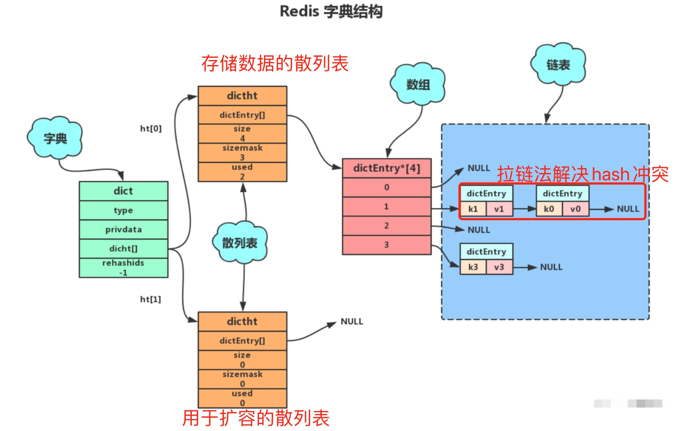
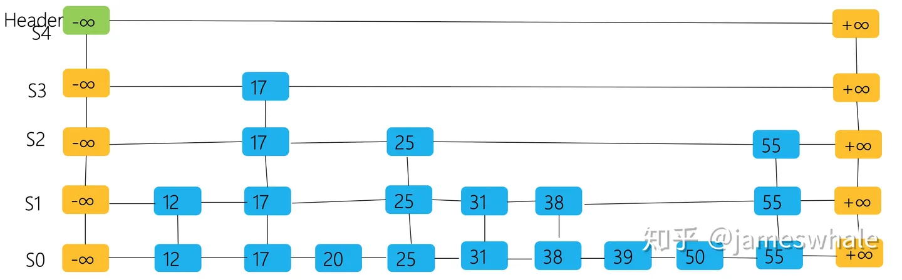
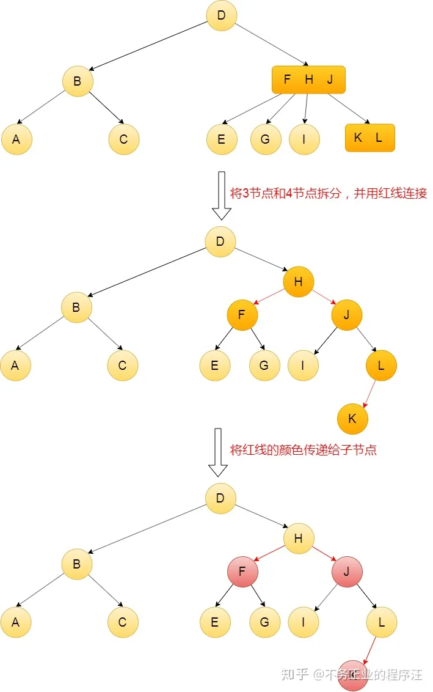
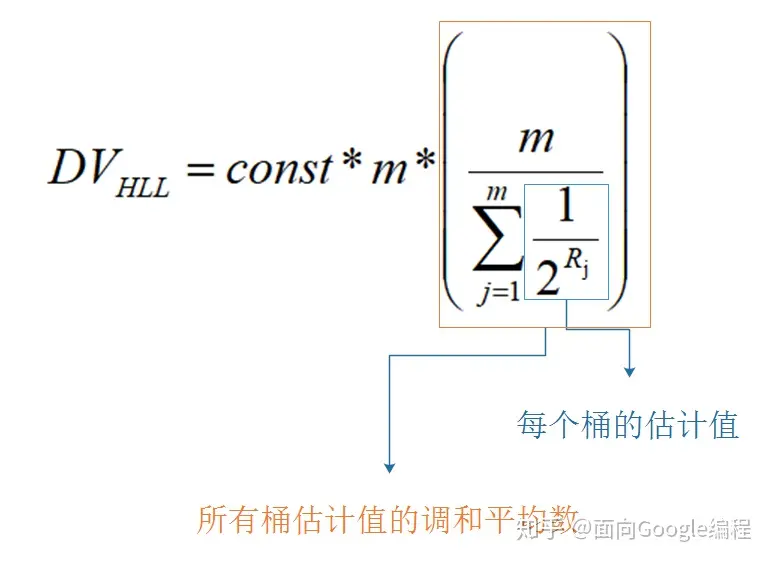

# redis与传统关系型数据库的区别
# 常用的数据结构
- string 

    最常用的单值存储，底层的RedisObject有三种encoding方式：
    - int  
    
    当value为整数且能够被当前操作系统中C语言long类型所存储的话，那么就会按照int的格式存储（long可能是32位也可能是64位，取决于redis编译时的编译器）。当对int编码的值进行修改致使它超过long表示的范围后，encoding就会变成embstr或者raw。
    - embstr
    
    redisObject的结构分为【type、encoding、ptr】，当encoding为embstr时，ptr存储的是一个SDS结构体指针（Simple Dynamic String）简单动态字符串。
    - raw 

    当SDS的长度超过某个阈值时
    
    > redis 2.+  --- 32 字节

    > redis 3.0-4.0 --- 39 字节

    > redis 5.0 ---  44 字节

    encoding会选择raw，redisObject底层其实还是SDS，与embstr的区别在于，raw格式的object在创建时，redisObject结构体和SDS结构体是分两次申请内存的，而embstr是一次申请。

    embstr优点在于创建和销毁的时候都只需要操作内存一次，且空间上object和SDS是连续的，更有利于利用CPU缓存。

    缺点在于embstr格式的对象是只读的，即如果使用append等指令修改其value时，底层其实将encoding升级为raw，重新分配SDS空间并复制之前的值再做出追加的修改。

    SDS相较于C语言中字符串的优势：

    1. SDS结构体内部会维护当前字符串的长度len，使用strlen命令获取长度时时间复杂度仅为O(1)，而C语言中仅通过字符串末尾的'\0'来标致结束
    2. 基于1中的设计，SDS的末尾也有一个'\0'，目的是能够复用一部分string.h中的库函数
    3. 由于维护了长度len，SDS也能存储二进制数据，如图片、音频、视频、压缩文件等
    4. SDS的API非常安全，不用担心对字符串进行操作会造成内存溢出，因为SDS的API底层会校验剩余可用空间，不够时会进行扩容。

    SDS的结构体：

    在redis3.2版本之前，SDS的实现还比较简单，内有len、free、buf三个元素
    ```c
    struct sdshdr {
        //记录buf数组中已使用字节的数量
        //等于SDS所保存字符串的长度
        unsigned int len;

        //记录buf数组中未使用字节的数量
        unsigned int free;

        //char数组，用于保存字符串
        char buf[];
    };
    ```
    显然，这一版本的实现会有很严重的内存浪费，即非常短的字符串也会在头内用到两个无符号整数来存储（每个2~4个字节，取决于编译器），于是redis在3.2及以后的版本中针对不同长度的字符串，采用了不同的header：

    根据索要存储字符串的长度，分别采用1、2、4、8字节的整型来记录len和buf的总长度alloc；采用一个字节的flag的低3位存储当前header采用的字节长度规格（3bit正好记录0~7 可以对应1到8字节）。

    上面四个规格对应sdshdr8~64，还有个sdshdr5，这个结构里没有len和alloc，而是使用flag的高5位来记录len，不过这个结构只用在了key的存储中，而value的存储最低只使用了sdshdr8

    ```c
    // 注意：sdshdr5从未被使用，Redis中只是访问flags。
    /* Note: sdshdr5 is never used, we just access the flags byte directly.
    * However is here to document the layout of type 5 SDS strings. */
    struct __attribute__ ((__packed__)) sdshdr5 {
        unsigned char flags; /* 低3位存储类型, 高5位存储长度 */
        char buf[];
    };
    struct __attribute__ ((__packed__)) sdshdr8 {
        uint8_t len; /* 已使用 */
        uint8_t alloc; /* 总长度，用1字节存储 */
        unsigned char flags; /* 低3位存储类型, 高5位预留 */
        char buf[];
    };
    struct __attribute__ ((__packed__)) sdshdr16 {
        uint16_t len; /* 已使用 */
        uint16_t alloc; /* 总长度，用2字节存储 */
        unsigned char flags; /* 低3位存储类型, 高5位预留 */
        char buf[];
    };
    struct __attribute__ ((__packed__)) sdshdr32 {
        uint32_t len; /* 已使用 */
        uint32_t alloc; /* 总长度，用4字节存储 */
        unsigned char flags; /* 低3位存储类型, 高5位预留 */
        char buf[];
    };
    struct __attribute__ ((__packed__)) sdshdr64 {
        uint64_t len; /* 已使用 */
        uint64_t alloc; /* 总长度，用8字节存储 */
        unsigned char flags; /* 低3位存储类型, 高5位预留 */
        char buf[];
    };
    ```

    注意到上面struct声明里的 ``__attribute__((__packed__))``，这是在告诉编译器，取消对这个结构体的字节对齐，而是按照实际占用的字节数进行存储，原因是，sds的指针其实指向的不是结构体的起始地址，而是buf的首地址，这是为了让sds指针能直接复用string.h里的函数；

    如果不进行对齐填充，就能保证sds的指针往回退一个字节就能找到flags的8个bit，进而根据header规格找到len和alloc的起始位置；相反如果进行了填充对齐，就破坏了这个巧妙的设计。

    > By default, a single Redis string can be a maximum of 512 MB.
    - set key value [EX seconds|PX milliseconds|EXAT timestamp|PXAT milliseconds-timestamp|KEEPTTL] [NX|XX] 
    - setnx key value   在老版本redis中 setnx不支持指定过期时间，所以实现分布式锁在加锁的环节需要用lua脚本使得setnx和expire原子地执行。
        > As of Redis version 2.6.12, this command is regarded as deprecated.
        It can be replaced by SET with the NX argument when migrating or writing new code.
    - get key
    - mget key1 key2 key3 ... 批量获取多个key
    - mset key1 val1 key2 val2 ... 原子性地批量设置多个kv
    - msetnx key1 val1 key2 val2 ... 原子性地设置多个key（当且仅当key不存在时才写，不会覆盖）
    - incr key  对于存储整数类型的key，可以原子性地加1，注意如果val是个浮点数则不能用incr
    - decr key
    - incrby key intvalue  对于存储整数类型的key，原子性地增加intvalue，同样不适用于浮点数
    - decrby
    - incrbyfloat key floatval 可以将整数型的key升级成浮点数，此后只能用incrbyfloat来修改其值
- list

    线性表结构，按照插入的顺序进行排序，可以用于构建队列/栈的结构，最大存储2^32 - 1个元素，即单列表支持存储超过``40亿个数据``。

    list的数据结构有以下三个阶段：

    - 压缩列表ziplist （元素数少于512、每个元素都小于64字节)    ->    双向链表list
    
    - redis3.2之后 list底层只使用quicklist

    - redis7.0之后 list底层改用listpack （这个结构很牛逼 但是ziplist和quicklist用得太多了 只能慢慢替代）

        - ziplist
            
                        
            entries占用内存连续，能够更好地利用CPU高速缓存。每个entry中存储上个entry的长度以及当前节点的长度，于是可以根据当前entry的指针快速移动到上/下个entry的起点。

            相较于链表而言，它能够更高效地利用内存（链表每个节点都要维护两个指针，指针所占字节是很长的，64位系统一个指针就8字节）；但是当所存储元素数量增多后，ziplist的查询和更新操作效率都很低。

            更致命的是，entry中的prelen在前一个entry长度小于254时，采用一个字节存储，否则会一下扩大到五个字节（第一个字节固定值为0xFE，用后面四个字节存储前一个entry的字节长度），极端情况下，对ziplist中一个元素做出修改使其变长，会导致后面所有节点的prelen都发生扩展，极度影响性能。
        - quicklist
            

            quicklist为了减小ziplist产生的连锁更新现象的影响，进行了改造。

            quicklist可以理解为一个链表，每个节点是一个ziplist，它严格限制了每个ziplist的长度，使其即时发生连锁更新，也不会影响太严重，同时也保证了每一个ziplist的查询和更新效率。

            另外，quicklistNode中ziplist还可以采用压缩算法进行压缩，从而生成一个LZF结构，node里的zl会指向这个LZF，进一步压榨内存，提高使用率。
        - listpack
        

        listpack也是优化ziplist后的一种数据结构，它的整体结构与ziplist类似，关键在于调整了entry内的结构，依次维护
        
        encoding --- 不同的编码会占1~5个字节不等，可以理解为前几个bit位用来枚举编码，剩下的比特位用于存储content中内容的长度
        
        data --- 存储本节点中的真实数据。
        
        slen --- 指的是当前字节对于本entry起始地址的偏移量，也是encoding + content的总字节长度。
        
        这里的设计非常巧妙，为了能够逆向遍历，需要根据当前节点找到上一个节点的起始位置，在ziplist中就是通过在entry中维护prelen来实现，而listpack中可以直接往前一个字节一个字节地读数据，每一个字节的最高位作为一个标记位，如果为1说明还没读完，如果为0说明已经读取了到了所有记录当前节点slen的字节。

- set

    redis的set底层有两种实现
    - intset

        1. 元素数量小于等于512
        2. 所有元素都能够被long long int类型所存储（如果存不下就会升级成hashtable存字符串）
        
        当满足以上两个条件时，才会用intset存储；
        
        intset内部维护元素数量、单个元素所占字节数的编码信息 以及存储数据的字节数组。

        contents内部是一个有序的、元素去重的数组，每次新增元素会将其插入正确的位置（如果发现已经存在则不插入）。
        
        结构体如下：

        ```c
        #define INTSET_ENC_INT16 (sizeof(int16_t))
        #define INTSET_ENC_INT32 (sizeof(int32_t))
        #define INTSET_ENC_INT64 (sizeof(int64_t))

        typedef struct intset {
            
                // 编码方式
                uint32_t encoding;  // 默认是INTSET_ENC_INT16 会随着插入元素数值的变大而单向升级
            
                // 集合包含的元素数量
                uint32_t length;
            
                // 保存元素的数组          contents最小单元是一个字节，但具体一个元素所占的字节数取决于encoding的值
                int8_t contents[];
            
        } intset;
        ```
    - hashtable （dict/字典  说的都是这个）
    
        当set中元素不满足intset时，就会切换为hashtable（不会再往回变成intset）。

        hashtable的结构体如下：

        > 注意到dict中的ht是有两个dictht元素的数组，其中第二个是在发生扩容的时候用于渐进式扩容用到的。
        ```c
        // 字典 
        typedef struct dict {
            // 指向 dictType 结构的指针（dictType 结构保存的是操作特定类型键值对的函数）
            dictType *type;
            // 保存上述所说函数的参数
            void *privdata;
            // 哈希表
            dictht ht[2];
            // rehash 索引，rehash 不进行时值为 -1 
            long rehashidx; /* rehashing not in progress if rehashidx == -1 */
            // 正在运行的迭代器数量
            int iterators; /* number of iterators currently running */
        } dict;

        // 哈希表 （相当于桶数组）
        typedef struct dictht {
                //哈希表数组
                dictEntry **table;
                //哈希表大小
                unsigned long size;
                //哈希表大小掩码，用于计算索引值
                unsigned long sizemask;
                //该哈希已有节点的数量
                unsigned long used;
        }dictht;

        //哈希表节点定义dictEntry结构表示，每个dictEntry结构都保存着一个键值对。（相当于桶里的链表节点）
        typedef struct dictEntry {
                //键
                void *key;
                //值
                union{
                void *val;
                    uint64_tu64;
                    int64_ts64;
                    }v;
                // 指向下个哈希表节点，形成链表
                struct dictEntry *next;
        }dictEntry;

        ```
        
- zset

    zset是维护着元素score值排序的set。

    所以它的实现有两部分：
    
    1. 实现set --- 这部分使用hashtable/dict/字典 用于快速在zset中查找一个key
    2. 实现score的排序 --- 这部分使用ziplist和skiplist 用于维护score的顺序结构 

    redis对内存利用的优化非常极致，有很多数据结构都是在数据规模小的时候极致利用内存而忽略时间复杂度；zset的ziplist就是处于这样的考虑。

    - ziplist 
        当满足「元素数少于128、每个元素都小于64字节」时，zset底层就用ziplist存储，其中每两个相邻的元素存储的是value和score。
    - skiplist
        
        跳表是面试中问到最多的数据结构，个人理解它的演化路径是这样的：维护一个有序的线性表，最简单的就是数组和链表；数组的插入效率低，链表的查询效率低。

        跳表其本质就是一个加上了索引结构的链表，目的是赋予链表进行二分查找的能力。

        可以这样描述一个跳表的结构：最低层是一个链表，而每一个节点中维护的不是一个next指针，而是32个next指针，每一个元素一定会出现在第0层链表中，又有1/2的概率出现在第1层链表中，依次类推，一个元素最高可能出现在第31层的链表中。skiplist中会维护所有节点中所出现的最高的层数，同时维护这32个链表的头结点地址。

        跳表的查询过程如下：
        
        从最高层数的链表头结点开始遍历，如果找到了目标值的元素则返回；如果找到第一个大于目标值的元素，那么继续遍历前一个节点低一层级的next指针对应的节点；如果走到当前层级最后一个元素，发现它还是比目标值小，那么继续遍历它下一层级next指针对应的节点；如果走到第0层了且当前节点值大于目标值，说明目标元素不存在。

        跳表非常巧妙的设计在于，并不是强制规定哪些节点会存在于哪一层的链表中，而是通过概率的方式，来保证约有1/2的元素在第1层，1/4的元素在第2层...如此保证整体查询的复杂度近似于O(logn)。
        

        通常会将skiplist与红黑树进行比较，skiplist的查询、删除、新增时间复杂度都是O(logN)，但由于节点层高是基于概率得来，可能在极端情况下，一直删除高层/底层节点，就会导致所有节点都位于底层/高层，进而查询效率会下降为O(N)。而红黑树的查询效率稳定为O(logN),它也能进行顺序遍历（中序遍历树），但是不支持范围查询。


        红黑树是一种改进之后的自平衡二叉查找树（每一个节点的左右子树高度差不超过1，控制高度，保证查找效率）。它的性质如下：

        1. 根节点为黑色，所有红色节点的子节点一定是黑色节点（如果它有子节点的话）。
        2. 满足AVL树的所有性质（左右子树高度差不超过1，左子比根小，右子比根大）。

        只要保证在插入和删除的过程中，一直维护上述性质，那它就是一棵红黑树。基于红黑树的颜色信息，还会有以下结论：

        从某个非叶子结点出发，它所到达所有叶子结点的路径中的黑色节点数量一定是一样的。

        这一个性质可以保证从一个节点出发，到达所有叶子结点的路径中，最长的长度不会超过最短的的两倍，进而保证红黑树在最差情况下的时间复杂度也能保持在O(logN)。

        这里总结一下树形结构：
        1. 二叉树 --- 一个节点两个子节点，没有顺序关系。
        2. 二叉查找树 BST --- 左子节点比根节点小，右子节点比根节点大；极端情况下会退化成链表，查询效率低。
        3. 自平衡 --- 能够在插入/删除过程中维护左右子树高度平衡的BST，但只是一个概念。
        4. AVL树 --- 这是1962年两个苏联人发明的自平衡二叉树，俩人名字是G. M. Adelson-Velsky和E. M. Landis，以他们名字命名了AVL树。在插入/删除时，会基于左右旋转的动作维护树的高度平衡。
        5. 2-3树 --- 在自平衡的基础上，一个非叶子节点内可以有1个或两个数据，对应有2个或3个子树。
        6. 2-3-4树 --- 一个非叶子结点内可以有1个或2个或3个数据，对应有2个或3个或4个子树。
        7. B树 --- 其实B树就是一个拓展的2-3-4树，如果degree为3，那么一个节点最多有3个子节点，这符合2-3树的定义；degree为4，那就是2-3-4树。
        8. B+树 --- B树无法顺序遍历，于是有了B+树，B+树的构建过程可以理解为给一个链表添加索引（链表一个节点中可以有一组数据），一层一层向上堆叠，形成了B+树。它可以通过O(logN)的时间复杂度查询一个元素，也可以在到达叶子节点之后横向地遍历，以达到范围查询的效果。
        9. 红黑树 --- 其实红黑树就是2-3-4树的变体，将2-3-4树的含有2个和3个元素的节点进行拆分，再将拆分后的线所连接的子节点变成红色，就变成红黑树了。
        

- hash

    哈希表的底层数据结构有两种：
    1. 当元素数少于512、每个元素都小于64字节时，使用ziplist
    2. 当不满足上述条件时，转换为hashtable(dict/字典)

    当使用hashtable时，会根据负载因子（存储元素数量/桶数）进行扩容/缩容：
    1. 小于1时不进行扩容
    2. 大于1小于5时，如果此时reids没有在执行bgsave和bgrewrite时，也会进行扩容
    3. 大于5时，不管是否在执行bgsave和bgrewrite，都会扩容
    4. 当小于0.1时，就会进行缩容。

    具体地，当触发扩容时，dict中的ht[1]会申请ht[0]两倍的空间，然后开始渐进式的扩容（整个过程又被称为rehash），当map发生增删改查时，都会触发rehash，dict中的rehashindex会记录当前迁移桶的index（不迁移时为-1），每次rehash都会把ht[0]中的一个桶里的元素存到ht[1]中再清空当前桶；在迁移过程中新增的key，会直接写入ht[1]，查询key时会先在ht[0]中找，找不到就去ht[1]里找。当rehashindex达到ht[0].size时，说明迁移完了，于是会将dict[0]重新设置为dict[1]，而dict[1]设置为null。

    > 为什么扩容会有两种条件呢？
    1. bgsave： fork一个子进程将当前内存快照写入rdb文件
    2. bgrewrite：fork一个子进程将当前的aof文件进行重写（对其进行体积优化）

    这两个操作都会先fork一个子进程，这里面有一个COW（copy on write）技术，它说的是对于linux系统而言，fork出来的子进程并不会从一开始就复制父进程的整个内存空间，而是将父进程的内存空间设置为只读，然后父子进程共享内存空间；当父进程或子进程对内存中的某个页进行写操作时，就会触发一个页异常中断，于是将本页复制一份供由本进程专门使用；即延迟复制发生的时间，且仅复制那些双方不一样的数据。

    在bgsave和bgrewrite正在进行时，为了尽可能减少父进程内存的写操作从而提升cow的性能，才会在这里将dict扩容的阈值上调到5。

    cow本质上就是一种延迟复制的思想，在对共享资源进行读多写少的访问时，也会用到：如果对共享资源加读写锁，而写操作实际上非常少，那么在所哟的读操作之前都要加锁，开销其实很大，于是可以引入cow机制，让读操作不加锁，而写操作加锁，并且在写操作发生时将共享资源复制一份后再进行修改，释放锁时再将原资源的指针指向修改之后的资源。如此可以保证并发的读请求和写请求之间数据隔离（java中的CopyOnWriteArrayList）。

- hyperloglog

    hyperloglog是一种近似算法，常用作不精确的去重数量统计，考虑下面的场景：

    业务需要统计某个页面的PV和UV
    
    - 其中PV可以以页面id为key，访问数量作为value，每多一次访问则incr key即可，对于简单的kv类型，如果value能够被long所存储，就只会占用4个或8个字节，不用考虑内存问题；
    - 但对于UV来说，需要以user_id去重后计数，那么可以采用set类型来存储，假设user_id是一个长度为36的字符串；set对于字符串类型采用dict存储，一个user_id至少要占用36字节（还要考虑dict中其他字段、指针的大小），当用户数量为100W时，一个页面的UV统计就至多要花掉1,000,000 * 36 byte = 36MB，若需要进行UV统计的页面增多、用户增多，这个内存开销是直线增加的。

    另一方面，UV统计往往不需要精确到个位，100万和101万UV在展示效果上没有太大区别，于是就可以使用hyperloglog进行非精确的去重统计。

    原理如下：

    考虑抛硬币的场景，每一次的结果要么正面要么反面，概率都为1/2。
    
  

    现规定从第一次抛硬币开始，如果遇到正面则记录出现正面的次数并继续，遇到反面则停止，此为一轮。
    
    如果我在很多轮尝试后，连续出现正面的计数最大值为10，那就可以估算我大概进行了2^10 = 1024轮尝试。因为如果我连续抛10次，每一次都是正面朝上，这件事发生的概率就是（1/2）^10 ≈ 0.0976%，理论上说，我得尝试1 / 0.0976% = 1024轮才会出现一次。

    可是万一我运气就有这么好，第一轮尝试就出来连续10个正面怎么办呢？那么可以同时多找些人来抛硬币，总不可能所有人运气都这么好吧？于是将m个人在若干轮中抛出来连续正面的次数ki求调和平均数后取倒数即可得到排除好运气之后，每个人所连续抛出正面的最大次数n，于是每个人尝试的轮数大约为2^n，所有人共进行m * 2^n次尝试。

    hyperloglog就是利用这个原理，对所有key分别计算哈希，对于每一个哈希值，取其最低n个bit进行桶编号映射称为HLL的精度，精度越高估算误差越小，空间开销也越大），剩余的bit从高往低排列，计算其中1第一次出现的位置，如果它大于桶中的值则更新。

    如此HHL(10)总共有2^10=1024个桶，对每个桶记录的最大的首次1出现的位置取调和平均数，再取倒数得到n，那么每个桶预估的不同key数量为2^n，于是m个桶总共预估不同key数量为m * 2^n。
    除此之外还会有一个基于桶数量m的修正系数const。

    HLL加入新元素的时间复杂度为O(1)，整体空间复杂度仅与精度m和基数N有关，而与需要去重的整体key数量n无关，其值值为O(mlog(logN)),换句话说，当精度m固定、整体基数（所有元素中不同元素的个数）不变时，需要去重的元素总体数量不影响存储空间。
    
- bitmap
- bitfield
- stream
- geospatial

# 内存清除策略
redis是一个基于内存的k-v数据库，它的持久化策略更偏向于用于数据的恢复，而不是像innodb那样用于检索，于是当redis进程所分配的内存空间不够用时，它不能将一部分数据持久化到磁盘以腾出内存空间，所以需要引入内存清除策略。

redis中的策略完整有八种： 

1. noeviction --- 不清除策略，当新的写请求到来时，只会去执行那些能让内存占用减少的指令（例如del和其他的删除类操作），其他的则返回内存不足的错误从而拒绝写入
2. volatile-lru --- 针对那些设置了过期时间的key，使用lru算法，移除那些最后一次使用时间最远的key；least recently used 最少最近使用。
3. allkeys-lru  --- 针对所有的key，使用lru算法淘汰
4. volatile-lfu --- 针对那些设置了过期时间的key，使用lfu算法，移除那些一段时间内使用频率最低的key；least frequently used最少频率使用。
5. allkeys-lfu  --- 针对所有的key，使用lfu算法淘汰
6. volatile-ttl --- 针对那些设置了过期时间的key，把那些距离过期时间最近的key移除。
7. volatile-random --- 针对那些设置了过期时间的key，随机删除
8. allkeys-random --- 针对所有key，随机删除

如果业务缓存数据真的数量庞大以至于会占满redis内存，那就应该考虑使用redis集群架构对数据进行分片存储，尽量避免驱逐策略的使用。

实际生产中，不应当把redis当做一个可靠的持久化存储设备，而应该是一个为数据库分担压力的缓存层，以保证业务在某些key被驱逐时的正确运行。

开启方式： 配置文件中设置maxmenmory和maxmemory-policy，另外mapmemory-samples [count]是在lru和ttl的驱逐策略下，会随机去待淘汰队列选取的key数量，在这随机捞出来的数据里选最应该被淘汰的，该数值默认是5，当设置为10时基本就趋近于精确的lru和ttl，但是会消耗更多的cpu资源。 由此可见，redis内存驱逐策略中的lru和ttl都是近似的，而不是完全精确的。 

# key过期策略
redis中的key通过时间戳的方式实现过期，对过期key的删除采用的是定时随机检测和惰性删除。

惰性删除指的是，当读取一个key的时候，redis会检查其过期时间与当前系统的时间戳，如果过期则删除它。

定时随机检测
# 持久化策略

# 主从同步原理

# 哨兵模式

# 集群模式

# 分布式锁
## 与用数据库实现、zookeeper、etcd的异同

# 分布式信号量

# 红锁

# 为什么快？

# 大key删除策略
1. 业务低谷时间阻塞删除 （不可靠）
2. 渐进式删除，首先将key
3. unlink

LSM tree  https://zhuanlan.zhihu.com/p/181498475  
bitcask: 简洁且能快速写入的存储系统模型 https://zhuanlan.zhihu.com/p/551334186