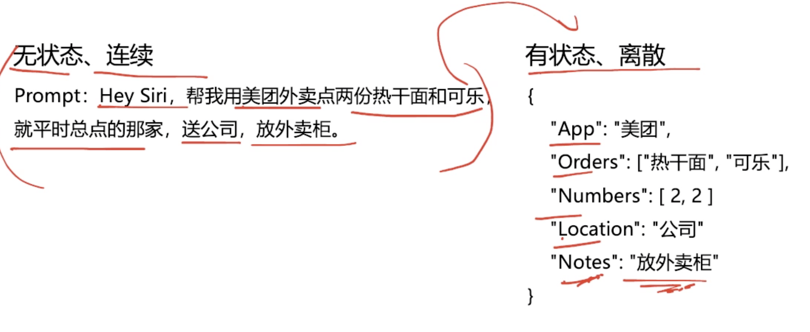
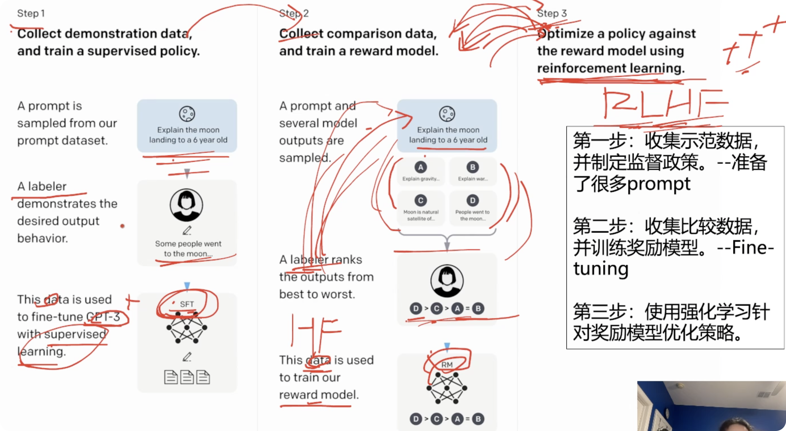
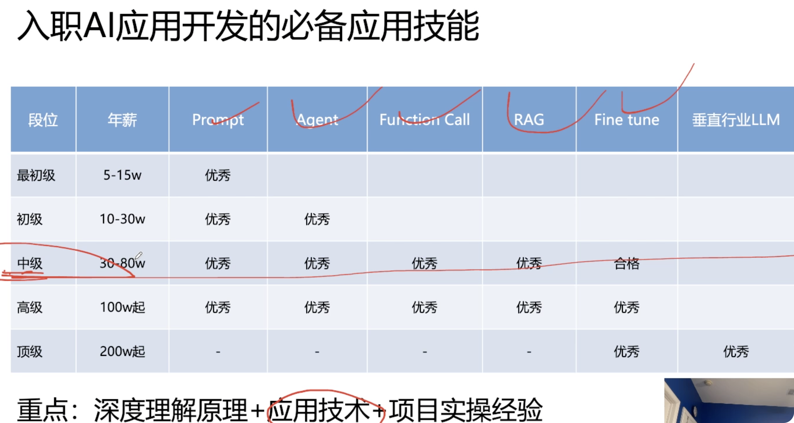
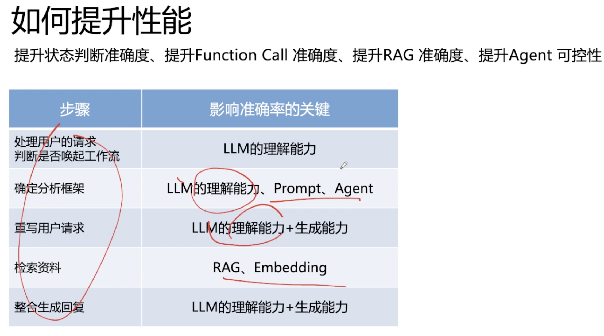
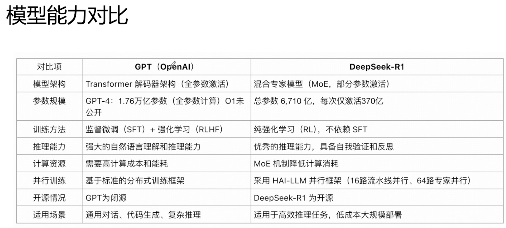
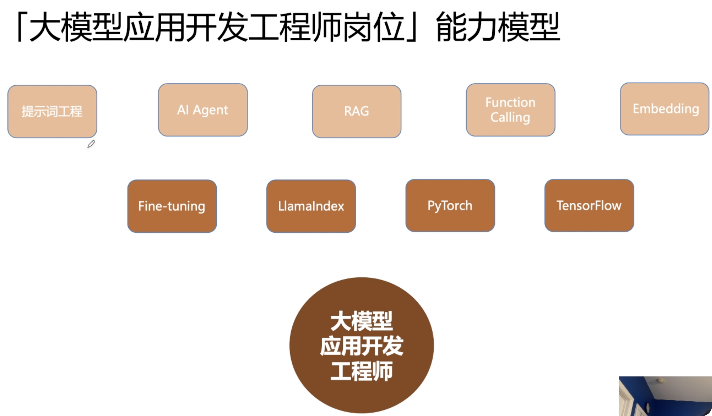

# transformer
Attenton Is All You Need
# rag
# mcp
# agent
# function call
1. LLM理解语义，自主决策使用工具，并能够结构化调用工具。
2. function call的成功率非常依赖于基座LLM。
3. 无状态&有状态：从模型输出角度来说，结构化地输出内容，就是有状态的（可以理解为在上下文中指定了模型的输出格式；结构化地输出结果，可以基于输出的结果在工作流中搭建逻辑分支）

4. 连续&离散：从数据的角度来看，离散意味着定量和可比较，基于离散的数据才可以做精确的分支判断

模型输出的有状态化、输出内容的离散化、数据流转的逻辑化

# Fine tuning:   
1. 专业人士打标（Q&A）有监督学习 SFT  
2. Human Feedback 人工给模型给出的结果进行质量排序，得到一个reward model   
3. 使用强化学习针对奖励模型优化策略
2 3 过程不断循环迭代

LLM应用开发 能力模型
