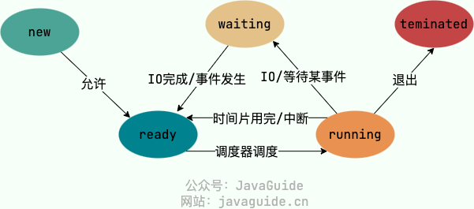

# 什么是操作系统

是运行在计算机上的一个程序，它统管整个计算机的硬件和软件资源，可以理解为工厂厂长。

# 操作系统有那些功能

上面说到 os 作为厂长，管理着工厂的所有资源，从这个角度来说它有以下功能：

1. 进程和线程的管理：进程的创建、销毁、阻塞、唤醒，进程间通信等 （工厂流水线管理）
2. 存储管理：内存和外存（磁盘）的分配和管理 （场地管理）
3. 文件管理：文件的读、写、创建和删除 （档案室）
4. 设备管理：输入输出以及外部存储设备的请求和释放、设备启动等功能 （设备管理处）
5. 网络管理：OS 负责管理计算机网络的使用 （客服办公室）
6. 安全管理：用户的身份认证、访问控制、文件加密等，防止非法用户对系统资源的访问和操作 （门卫室）

# 用户态和内核态

内核（kernel）指的是操作系统中的一个核心部分，它主要负责上述的资源管理功能。

从 CPU 指令的角度来看，有很多指令是比较危险的，例如内存分配、设置时钟、IO 处理等，如果将这些指令直接暴露给所有进程，那么整个计算机就会处于非常混乱、危险的状态；
从系统实现上来看，如果所有进程都有权限访问上述资源（如 CPU、内存、硬盘），势必造成非常混乱的资源竞争和冲突，影响系统运行的效率、稳定性和安全性。

于是操作系统将这部分核心资源隔离起来，统一交由内核来管理，内核拥有一块独享的内存区域。

对于内核进程来说，它这种掌控全局的运行状态被称为「内核态」。

而其他进程只能访问自己的内存空间和受限的系统资源，这种状态被称为「用户态」。

任何用户态进程如果需要访问那些核心资源，如磁盘访问、进程调度、内存管理、文件系统、网络调用等等，都需要通过系统调用来向内核发起请求。

用户态进程本身是不会直接变成内核态进程的。

- 内核进程主要负责执行操作系统内核的任务，例如系统调度、内存管理、设备驱动等。内核进程通常在系统启动时创建，用于支持整个系统的正常运行。
- 用户进程是由用户直接或间接创建的进程，用于执行各种应用程序、服务和脚本。用户进程可以在系统运行时按需创建和销毁，以满足用户的需求。

我们常说的「用户态」到「内核态」的切换，其实并不是指一个进程从用户态切换到内核态；

我认为具体地这是指，CPU 从正常执行用户进程的指令 -> 收到 trap 指令 -> 保存当前进程的状态（程序计数器、寄存器）并将其挂起 -> 转而执行 trap 指向的系统调用程序 -> 取得返回值并写入内存 —> 将该内存地址返回给之前挂起的用户进程 -> 恢复用户进程的执行 这一整个过程。

综上，这个切换其实指的是 CPU 的控制权从一个用户态进程变为内核进程的整个过程。

而这个切换过程有三种情形：

1. 系统调用 Trap，即用户态程序中主动发起系统调用，CPU 中断执行并将控制权交给内核去执行具体的接口。
2. 中断 Interrupt，这是来自于硬件设备的信号，CPU 会中断当前用户进程的执行并优先处理这个中断信号的处理程序。
3. 异常 Exception， 当 CPU 执行用户态程序时，发生了某些事先不可知的异常（除以 0、内存缺页等），也会中断程序的执行转而执行异常处理程序。

# 系统调用

从功能上系统调用大致可以分为如下几类：

1. 内存管理： 完成内存的分配、回收以及获取作业占用内存区大小以及地址等功能
2. 文件管理： 完成文件的读、写、创建、删除等功能
3. 进程管理： 完成进程的创建、撤销、阻塞、唤醒，进程间通信等功能
4. 设备管理： 完成设备（输入/输出设备、外部存储设备）的启动、请求、释放

系统调用和库函数非常相似，区别在于：

- 库函数由用户自己或者 os 的函数库提供，运行在用户态
- 系统调用由 os 内核提供，运行于内核态

系统调用的过程：

1. 用户态程序被编译后从汇编代码的角度看，就是一系列的指令，其中可以通过 int 0x80 来触发系统调用（在 x86 架构中），这一动作又称之为 trap。

2. 对于 CPU 来说，该指令也是一种中断，此时就会保存用户进程的状态（寄存器、指令计数器等），并跳转执行对应的系统调用处理程序（相当于换到内核进程去执行）。

3. 内核处理完成之后（拿到返回值、写到内存、记录内存地址到寄存器），也是通过 trap 使得 CPU 切换回到用户进程。

# 进程和线程

## 什么是进程和线程？

- 进程（process）是计算机中正在运行的一个程序实例。

  每一个进程都有自己独立的内存空间、代码、数据和系统资源，这些资源在进程之间是隔离的。

  进程是操作系统中资源分配的基本单位，如 CPU 时间、内存空间、文件系统等。

- 线程（thread）又被称为轻量级进程，它是进程中的最小执行单元。

  在绝大多数的现代操作系统实现中，线程都是 CPU 调度的基本单位。

  每个线程都有自己的程序计数器、栈内存和寄存器等资源，但一个进程创建的线程之间是共享进程的内存空间和系统资源的。

  线程之间可以访问彼此的内存空间和资源，因此线程间通信比进程间通信的开销更小、效率更高。

## 为什么要使用多线程？

- 在 CPU 单核时代，一个单线程程序如果遇到了 IO 阻塞，那么整个程序都会暂停执行而 CPU 不能得到有效的利用；而多线程程序就可以在一个线程遇到 IO 阻塞时，让其他线程继续使用 CPU 进而提高整个程序对系统资源的利用效率。
- 在 CPU 多核时代，当需要执行一些计算密集型任务时，单线程程序同时只能利用一个核心，而其他核心白白浪费；此时多线程程序就可以将该任务划分给多个线程，进而高效地利用所有 CPU 核心进行计算，成倍提高任务的执行效率。

## 线程之间如何同步？

一个进程下的多个线程在执行任务时，共享了进程的内存空间和各种资源，难免会出现对同一个资源的竞争，这里指的同步就是在这种情况下如何让多个线程正确地访问这些共享资源。

以下是几种常用的同步方式：

- 互斥锁：通过互斥对象来控制多个线程对同一资源的访问，在同一时刻至多只能有一个线程享有对该资源的读写权。
- 读写锁：允许多个线程同时读取共享资源，但是同一时刻至多只能有一个线程享有对该资源的写权限。
- 信号量：限制在同一时刻能够对某共享资源进行读写的最大线程数量。
- 屏障：用于等待多个线程全都到达某一阶段，再继续执行。
- 事件：通过通知的方式来保持多线程之间的同步。

## 进程的构成

在 linux 系统中，一个进程被创建之后，操作系统会为其生成一个 PCB(Process Control Block)，用于记录其所有信息：

- 进程的描述信息：进程名称、标识符（PID）等。
- 进程的调度信息：进程状态（Running、Blocked、Ready
  ）、阻塞原因、优先级等。
- 进程的资源信息：操作系统对进程使用资源的约束情况（CPU 时间、内存、文件描述符等）
- 进程打开的文件信息： 文件描述符列表（文件/套接字）、文件类型、打开模式。
- 进程执行相关信息：程序代码、进程数据（全局变量、静态变量等）、堆地址、栈地址、指令计数器、寄存器等。

## 进程的状态

进程大致有五种状态：

- 创建状态（new）： 正在被创建，尚未就绪
- 就绪状态（ready）：进程已经处于准备运行状态，已经获取了除 CPU 之外的所有资源
- 运行状态（running）：进程正在 CPU 上运行
- 阻塞状态（blocked/waiting）：进程正在等待某一事件而暂停执行，例如等待 IO 操作完成，此时 CPU 资源空闲，但是进程也不能运行
- 结束状态（terminated）：进程正在从系统中消失。
  

## 进程间通信的方式

- 管道/匿名管道： 只能在父子/兄弟进程之间通信，通过仅存在于内存中的文件实现。
- 具名管道：可以在不具有亲缘关系的进程间使用，严格遵循 FIFO 原则，通过磁盘文件的方式实现。
- 信号：是一种比较复杂的通信方式，可以告知信号的接受进程某件事已经发生。
- 消息队列：是一个是现在内核中的链表，它也遵循 FIFO 原则，但是支持消息的随机查询、按类读取，比 FIFO 更有优势。它没有了信号量承载信息少、管道只支持无格式字节流和收到缓冲区大小限制的劣势。
- 信号量：信号量是一个计数器，更准确地说它是实现进程之间并发控制的一种方式。
- 共享内存：使得多个进程共享一块内存空间，再加上诸如互斥锁、信号量等并发控制策略，这是最有用的进程间通信方式。
- socket：这是支持 TCP/IP 的网络通信的基本操作单元，可以实现不同主机之间的进程间通信。

## 进程调度算法

- 先到先服务（First Come First Served）：就绪队列中选择最先进入队列的进程并为之分配 CPU 资源。
- 短作业优先（Shortest Job First）：从就绪队列中选择一个估算运行时间最短的进程。
- 时间片轮转（Round-Bobin）：每个进程都被分配一个相同大小的时间片，简单且公平。
- 优先级调度算法（Priority）：根据内存要求、时间要求和其他资源来确定进程的优先级，优先级高的先执行；同优先级的按照 FCFS 原则调度。
- 多级反馈队列调度算法（Milti-Level Feedback Queue）：MLFQ 中含有多个独立的队列，队列的优先级依次降低，对于每个队列采用 RR 的策略进行轮转，这些队列的轮转时间片依次变长；当新任务到达时将它放入优先级最高的队列，当一个进程消耗完一个完整的时间片后，它将会被放到下一级队列中。如此，计算密集型的长任务就会逐渐掉落到优先级最低的队列中，而简单的交互型短任务就会在最高优先级队列中快速地执行完毕。另一方面，为了防止持续到来的短任务一直执行而使得长任务产生饥饿，MLFQ 会定期将所有任务全部放入最高优先级队列。

## 僵尸进程和孤儿进程

在 Unix/Linux 系统中，子进程通常都是父进程通过 fork()函数创建的，子进程是父进程的一个副本，拥有完全一样但相互隔离的内存空间和系统资源，当然也可以共享一些进程资源，例如打开的文件、网络连接等。

- 僵尸进程

  当一个进程使用 exit()系统调用来结束自己的生命时，内核就会释放该进程的大部分资源，包括打开的文件、占用的内存等，但是这个进程的 PCB 并不会被删除，因为 OS 被设计为：当子进程退出后，父进程可以通过 wait()或者 waitpid()来获取子进程的状态信息。

  基于上面的设计，当子进程 exit()后，如果父进程代码里没有显式地调用 wait()或者 waitpid()，那么子进程的 PCB 就会一直存在，进而形成一个僵尸进程（Zombie）。PCB 本身也是一种资源占用，大量僵尸进程也会占用系统资源进而影响性能。

- 孤儿进程

  指的是父进程已经退出或者异常终止，而自身还在执行的子进程，它会一直占用系统资源，直到被操作系统回收。在 Unix/Linux 系统中，init 进程（内核）会定期扫描所有进程，收养其中 PPID（父进程 id）已经不存在的 zombie 进程，将其 PPID 设置为 1，最后会将其回收并释放 PCB 资源。

  与僵尸进程类似的，孤儿进程在被 init 回收之前，即时它也通过 exit()系统调用释放了大部分资源，但其 PCB 依旧会留存在 OS 中占用资源，但最终 OS 会把其释放，问题不大。

- 如何查看僵尸进程？

  在 Unix/Linux 系统下使用 top 命令即可在 Tasks 一栏中查看 zombie 数量，具体地 top 命令值得关注的一些数据：

  ```javascript
  // 当前时间，服务器启动8天2小时46分，登录0个用户，在过去的1、5、15分钟内，CPU正在运行的进程数和正在等待CPU的进程数的比值，越大说明CPU负载越重
  top - 17:27:32 up 8 days,  2:46,  0 users,  load average: 0.08, 0.12, 0.19
  // 总进程数、运行中进程、等待调度进程数、停止进程数、僵尸进程数
  Tasks:   4 total,   1 running,   3 sleeping,   0 stopped,   0 zombie
  // 可以按数字1切换各个CPU数据和总数据
  // us-用户空间CPU占比
  // sy-内核空间CPU占比（可以理解为系统调用的繁忙程度）
  // ni-指的是通过renice -n xx pid指令修改优先级之后的进程所占CPU时间
  // id-指的是空闲CPU时间
  // wa-等待IO的CPU时间，当系统平均负载高时，可以看wa是否也高，如果是则瓶颈在IO上
  // hi-硬件中断消耗CPU时间（来自硬盘、网卡等硬件设备的中断）
  // si-软件中断消耗CPU时间
  %Cpu0  :  1.0 us,  0.0 sy,  0.0 ni, 99.0 id,  0.0 wa,  0.0 hi,  0.0 si,  0.0 st
  %Cpu1  :  1.0 us,  1.0 sy,  0.0 ni, 98.0 id,  0.0 wa,  0.0 hi,  0.0 si,  0.0 st
  %Cpu2  :  4.0 us,  1.0 sy,  0.0 ni, 94.9 id,  0.0 wa,  0.0 hi,  0.0 si,  0.0 st
  %Cpu3  :  1.0 us,  2.0 sy,  0.0 ni, 97.0 id,  0.0 wa,  0.0 hi,  0.0 si,  0.0 st
  // 总物理内存， 空闲内存， 占用内存， 物理内存中被用作缓冲区的大小（用于加速内存与磁盘的数据交互）
  KiB Mem :  7751564 total,   159004 free,  1283076 used,  6309484 buff/cache
  // 交换区内存总量，空闲交换区总量，使用的交换区总量，系统可以使用的物理内存总数（瞬时，buff/cache可以理解为「可用作缓冲区的内存大小」，但Mem.used才是真正的被占用了的物理内存，所以avail Mem是Mem.free + Mem.buff/cache中瞬时未被占用的那一部分）
  // Swap可以理解为当物理内存不够用时，持久化到硬盘上的那一部分虚拟内存，所以物理内存free比较小时，如果swap的used还很小说明物理内存其实压力不大；如果swap的used很高，说明物理内存是已经持久化一部分到硬盘之后依然不够用
  KiB Swap:        0 total,        0 free,        0 used.  5982412 avail Mem

  // 可以按F键具体查看各个字段的含义，F界面按空格来显示/隐藏字段 上下键选择字段 右键选中字段后可以上下调整字段顺序，左或enter提交位置调整  按s选择排序字段 q退出F界面
  // 进程id  所属用户名 优先级  虚拟内存总量 进程使用的未被换出的物理内存大小 共享内存大小 CPU时间占用百分比 物理内存占用百分比 进程使用的CPU时间总计[分:秒.百分之一秒] 命令名（可以按c来切换完整命令）
  // 可以按e来切换下面的内存单位   E是切换上面的Mem和Swap单位
  // Z切换彩色显示 B加粗  R  renice设置优先级  h-查看帮助 s修改内容刷新频率
  PID USER      PR    VIRT    RES    SHR S  %CPU %MEM     TIME+ COMMAND
  1 root      20  113.8m   3.3m   2.9m S   0.0  0.0   0:00.01 sh
  19 root      20  999.2m  47.3m  21.7m S   0.0  0.6   1:28.01 doctor-server-e
  482 root      20  114.0m   3.6m   3.0m S   0.0  0.0   0:00.00 bash
  504 root      20  159.2m   4.2m   3.6m R   0.0  0.1   0:03.06
  ```

# 死锁

## 什么是死锁？

指两个或两个以上的线程同时被阻塞，他们中的每一个都在试图获取已经被其他某个/些线程占用的资源，而自身又都因为阻塞状态而无法释放自己已占用的资源。这种所有线程都阻塞且程序不能正产终止的情况就是死锁。

## 死锁形成的条件？

1. 资源互斥访问 --- 资源处于非共享模式，同一时刻至多只有一个线程可以占有。
2. 持有并等待 --- 每一个线程至少已经占有一个资源，并且正在等待另一个资源。
3. 非抢占式 --- 一个已经被占用的资源不能被其他线程抢占，只能由当前线程主动释放。
4. 循环等待 --- 形成死锁的多个线程之间要形成循环的持有-等待关系，例如 A 要 B 的资源，B 要 C 的资源，C 又要 A 的资源。

## 解决死锁的办法

一般可以从 预防、避免、检测和解除 四个角度来处理死锁问题：

- 预防： 采用一定的策略，破坏死锁形成的四个条件之一，使得程序在任何时候都不可能产生死锁
  - 破坏互斥 --- 允许资源的共享，大多数情况下行不通
  - 破坏等待 --- 线程要么一次性获得所有需要的资源，要么一个资源也不占有
  - 破坏非抢占式 --- 允许资源抢占式的调度，但不适用于所有资源（适合内存、CPU 资源的调度）
  - 破坏循环等待 --- 将资源分层，线程在只有一个层次的资源之后，只允许申请更高层的资源；当需要释放资源时只允许先释放较高层资源，如此系统就不可能出现死锁。
- 避免： 允许出现产生死锁的四个必要条件，但是在给线程分配资源的时候加上一定策略,判断如此分配之后是否会出现死锁。即将系统氛围安全状态和不安全状态，在为申请者分配资源之前做一次分配测试，如果分配后系统依旧安全则保持分配，否则撤销测试时的分配。（详见银行家算法）
- 检测：系统中设置专门的机构，定期检测死锁的发生。
- 解除：配合检测机制，必要时将造成死锁的部分线程挂起或者撤销以释放整个循环等待链路中的某些资源。

# 虚拟内存
## 内存碎片
- 内部碎片

  当采用2的幂次分配内存时，可能会给进程分配超过其需求的大小（比如要65字节，那就会分配2^7 = 128字节），这些分配给进程但并不被实际需要的就是内部碎片。
- 外部碎片

  那些未被分配的、并不连续的、太小的内存区域，会构成外部碎片。他们因为太小了不足以满足进程的需要，又因为不连续而无法整合。
 
## 常见内存管理
- 连续内存管理

  为一个用户程序分配一个连续的内存空间，内存利用率一般不高。
  
  - 块式管理
  
    linux中连续内存管理采用了「伙伴系统 buddy system」来实现。

    其主要思想是将内存全都按照2的幂次来划分，当进程请求某个大小的内存块时，伙伴系统为其寻找一个足够大的内存块，如果这个内存块一分为二之后依然能够满足需求，那么将另一半释放，对于剩下的一半重复刚刚的二分操作直到它不能再小。那些相邻的内存块被视为一对伙伴，当一对伙伴均被释放时，该算法就会将它们合并成为一个更大的内存块。

    伙伴系统解决了外部碎片的问题，但依然会因为内部碎片而得不到很高的内存利用率。
- 非连续内存管理

  允许一个程序使用的内存分布在离散或者说不相邻的内存中，相对更加灵活一点。
  - 段式管理

    以段的形式管理/分配物理内存。应用程序的虚拟地址空间被分为大小不等的段。每个段都有自己的逻辑信息，例如主程序段MAIN、子程序段X、数据段D以及栈段S等。
  - 页式管理

    把物理内存分为连续等长的物理页，应用程序的虚拟地址空间也被划分为连续等长的虚拟页，这是现代操作系统广泛使用的一种内存管理方式。
  - 段页式管理机制

    结合了以上两种方式，物理内存先分成若干段，每一段再分成若干大小相等的页


## 什么是虚拟内存？有什么用？

虚拟内存（Virtual Memory）是一种尽在逻辑上存在的内存空间，操作系统通过映射算法将虚拟内存空间中的地址映射成为物理内存空间中的地址，它是进程访问主存（物理内存）的桥梁。

具体来说虚拟内存提供了以下能力：

- 隔离进程的内存空间：

  进程独立享有自己的虚拟内存空间，进程之间无法直接通过物理内存地址访问到彼此的内存空间，保障了进程和系统的安全性、稳定性。
- 提升物理内存利用率：

  虚拟内存技术中的一个核心点就是换页技术，简单来说就是将一个进程的虚拟内存空间中那些不那么可能会被马上用到的部分放到磁盘中，那些刚被用过或者可能即将被用到的部分留在物理内存中。如此对于大部分进程来说，只需要将当前使用到的部分数据和指令加载到物理内存中。

- 简化内存管理

  每一个进程都有自己独立的虚拟内存空间，虚拟到物理的映射无需程序员关心，即向用户屏蔽了复杂的物理内存管理。

- 多进程共享物理内存
  
  很多进程在运行时都会依赖操作系统提供的动态库，而这些库函数对于每个进程而言都是共用的，于是操作系统只需要将各个进程中指向该库函数的虚拟内存地址统一映射成物理内存中的固定地址，就可以非常方便地实现物理内存共享，提升利用率。

- 提供更大的可用内存空间

  虚拟内存空间加上换页机制，可以使得程序拥有超过物理内存大小的可用内存空间。即一个进程所享有的内存页会根据实时的需求在主存和磁盘之间反复横跳。


## 虚拟地址和物理地址？
- 虚拟地址空间是虚拟地址的集合，是虚拟内存的范围。每一个进程都有一个一致且私有的虚拟地址空间。
- 物理地址空间是物理地址的集合，是物理内存的范围。
## 分段机制
分段机制（Segmentation） 以段(—段 连续 的物理内存)的形式管理/分配物理内存。应用程序的虚拟地址空间被分为大小不等的段，段是有实际意义的，每个段定义了一组逻辑信息，例如有主程序段 MAIN、子程序段 X、数据段 D 及栈段 S 等。

分段机制中，每一个虚拟地址分为「段号/offset」，每一个进程都会有一个「段表」，用于记录对于该进程来说「段号」到「主存地址前缀」的映射关系，那么主存地址前缀 + offset就是这个虚拟地址对应的物理地址。


分段机制会引发外部碎片的问题，即主存被分成了很多大小不同的段，那些不连续的小段不能满足进程对连续虚拟内存空间的需求，对主存来说利用率很低。
## 分页机制
分页机制是把主存分成了很多等大的页，这个大小被称为「物理页框大小（frame size）」，通常来说一页大小为4KB。

如此一来，主存的最小分配单位就是4KB，一个进程连续的虚拟内存地址，可以被映射到离散的物理地址空间中去，巧妙地解决了外部内存碎片的问题。

在分页机制下，CPU中的MMU(Memory Management Unit)在将虚拟地址映射到物理地址时，需要去查一个「关系映射表」，这个东西就是页表。

- 一级页表

  以32位地址空间（4Byte）为例，物理页框大小为4KB(即2^12个字节)，那么它在虚拟地址中就需要12个bit来记录某个地址在一页中的offset值，于是32位的地址还剩下20bit用来编码物理页。

  经过上面的计算，一个进程的虚拟内存空间共有2^20页，每一页有4KB大小，即有4GB的虚拟内存。

  在一级页表的情况下，我们考虑页表（Page Table）中的页表项(Page Table Entry)的结构: 逻辑上的映射关系一般是<key, value>, 但由于虚拟内存空间是连续的，我们其实可以不用再PTE中存储key，而是把一个PT当做一个数组，index即是虚拟内存前20bit对应的页码（总共有2^20个），而PT[index]就是它对应的物理页的首地址（因为其值是个地址，所以长度是32位）。

  举个例子，进程的虚拟地址为「0000 0000 0000 0001 0001 | 0000 0000 1000」，就表示这是虚拟页中的第16页当中offset为8的那个字节。

  如此以来，对于一个进程的PT，这个数组一定要有2^20长，那么它就会占用 2^20 * 4Byte = 2^22 Byte = 4MB。于是一个进程的页表就需要占用主存4MB的大小。
- 多级页表

  显然一级页表会占用大量宝贵的主存，而绝大多数的进程根本用不到期虚拟内存空间中的所有地址，那么为其开辟的2^20长的PT数组完全就是浪费。

  多级页表就是为了解决这种浪费，它的思想很简单，即多层映射叠加：

  同样以物理页框大小为4KB为例，一页中有2^12字节，那么32位的地址中需要12位来确定某个字节在页中的offset，于是剩下20bit来确定在哪一个物理页。

  以二级缓存为例，我们把这20bit分成两部分：前10bit来映射一级页表（记为i），后10bit映射二级页（记为j）；
  
  换个角度想就是，页表结构从一张一级页表变成了一张一级页表+至多1024张二级页表。

  一维页表只要查一次，就可以由PT[index]确定物理页的起始地址；而二级页表要查两次，先通过i作为index去一级页表中找到某个二级页表的起始地址，再以j作为index去这个二级页表中找到真正的物理页起始位置。

  为什么说多级页表结构可以节省内存呢？举个例子：

  假设我们一个进程只需要用到4MB的内存，一页有4KB，那么4MB只要1024页，即只需要1个一级页表+1个二级页表就能完成所有映射，那么它可能用到的虚拟地址范围如下：

  
  「0000 0000 00|00 0000 0000 | 0000 0000 0000」
  
  「0000 0000 00|11  1111 1111 | 1111 1111 1111」

   前10位对应一级页表中的第0项， 中间10位对应二级页表中的1024项，最后12位对应物理页中的2^12个字节。

   对于这一个进程而言，一级页表中只有index=0的地方存储的值是一个有效的二级页表首地址，而其他1023个位置都是空指针，于是这些空指针对应的二级页表就压根不用创建；
   
   而一级页表机制中，那个长度为2^20的，元素大小为4Byte的PT数组需要占用4MB的内存，即需要占用4MB / 4KB = 1024个物理页。

   2页和1024页的差距就非常之大了。

   现代操作系统一般都是64位地址空间的，如果也以4kb一页来算，那么地址中可以有64 - 12 = 52bit用来编码页数，理论上来说一个进程的虚拟内存空间就可以有2^52页那么大，然而实际不会使用到这么多内存，64bit地址中只会有一部分用于映射物理内存。

   以上举例中的数值（包括物理页框4KB，虚拟页号长度20，虚拟页偏移长度12）都是理想化情况的值，而实际上每个PTE中的32个bit不会全都用于标识下一个页，还会有很多标志位用于指示当前页的状态，后面提到的换页、页缺失等机制就需要依赖这些标志位。

## TLB
Translation Lookaside Buffer 又被称为快表，它是MMU中的一个内部单元，本质上就是一块高速cache。

它的作用是加速由虚拟内存地址到物理内存地址映射过程，简单理解为一个<虚拟页码, 物理页码>的缓存就好了。


## 换页机制
换页机制的思想是当物理内存不够用的时候，操作系统选择将一些物理页的内容放到磁盘上去，等要用到的时候再将它们读取到物理内存中。也就是说，换页机制利用磁盘这种较低廉的存储设备扩展的物理内存。

这是典型的时间换空间策略：用CPU计算的时间和页从磁盘到主存的读写时间，换来了单个进程更大的虚拟内存空间。
## 页缺失
页缺失（Page Fault，又名硬错误、硬中断、分页错误、寻页缺失、缺页中断、页故障等）指的是当软件试图访问已映射在虚拟地址空间中，但是目前并未被加载在物理内存中的一个分页时，由 MMU 所发出的中断。


常见的页缺失有下面这两种：

- 硬性页缺失（Hard Page Fault）：物理内存中没有对应的物理页。于是，Page Fault Handler 会指示 CPU 从已经打开的磁盘文件中读取相应的内容到物理内存，而后交由 MMU 建立相应的虚拟页和物理页的映射关系。
- 软性页缺失（Soft Page Fault）：物理内存中有对应的物理页，但虚拟页还未和物理页建立映射。于是，Page Fault Handler 会指示 MMU 建立相应的虚拟页和物理页的映射关系。

- 发生上面这两种缺页错误的时候，应用程序访问的是有效的物理内存，只是出现了物理页缺失或者虚拟页和物理页的映射关系未建立的问题。如果应用程序访问的是无效的物理内存的话，还会出现 无效缺页错误（Invalid Page Fault） 。

当发生硬性页缺失时，OS就必须挑选合适的页踢到磁盘里，再将缺失的目标页从磁盘写入到主存。

这个置换过程对应的规则就是「页面置换算法」。


- 最佳页面置换算法（OPT，Optimal）：

  优先选择淘汰的页面是以后永不使用的，或者是在最长时间内不再被访问的页面，这样可以保证获得最低的缺页率。但由于人们目前无法预知进程在内存下的若干页面中哪个是未来最长时间内不再被访问的，因而该算法无法实现，只是理论最优的页面置换算法，可以作为衡量其他置换算法优劣的标准。
- 先进先出页面置换算法（FIFO，First In First Out） : 

  最简单的一种页面置换算法，总是淘汰最先进入内存的页面，即选择在内存中驻留时间最久的页面进行淘汰。该算法易于实现和理解，一般只需要通过一个 FIFO 队列即可需求。不过，它的性能并不是很好。
- 最近最久未使用页面置换算法（LRU ，Least Recently Used）：

  LRU 算法赋予每个页面一个访问字段，用来记录一个页面自上次被访问以来所经历的时间 T，当须淘汰一个页面时，选择现有页面中其 T 值最大的，即最近最久未使用的页面予以淘汰。LRU 算法是根据各页之前的访问情况来实现，因此是易于实现的。OPT 算法是根据各页未来的访问情况来实现，因此是不可实现的。
- 最少使用页面置换算法（LFU，Least Frequently Used） : 

  和 LRU 算法比较像，不过该置换算法选择的是之前一段时间内使用最少的页面作为淘汰页。
- 时钟页面置换算法（Clock）：

  可以认为是一种最近未使用算法，即逐出的页面都是最近没有使用的那个。

  实际使用最多的置换算法就是LRU，这也是面试中最经常提及的。

## 局部性原理
要想更好地理解虚拟内存技术，必须要知道计算机中著名的 局部性原理（Locality Principle）。另外，局部性原理既适用于程序结构，也适用于数据结构，是非常重要的一个概念。

局部性原理是指在程序执行过程中，数据和指令的访问存在一定的空间和时间上的局部性特点。其中，时间局部性是指一个数据项或指令在一段时间内被反复使用的特点，空间局部性是指一个数据项或指令在一段时间内与其相邻的数据项或指令被反复使用的特点。

# 计算机网络

# Linux 基础

## 文件系统

## 常用命令

- 目录切换
  - cd ..    上一级目录
  - cd /     跟目录
  - cd ~     当前用户的默认工作目录
- 文件操作
  - ls -lh   列出当前目录下文件 展示大小、创建时间
  - cp originfile  targetdir/targetfile  复制文件
  - mv originfile targetdir/targetfile   移动文件 也常用于重命名
- 文件压缩和传输
  - tar -zcvf  outName  targetFile[./]    压缩文件
  - tar -zxvf  outName     解压文件
- 文件权限

  chmod [对谁操作] [操作符] [赋予的权限] 文件名

  在ls -lh命令中可以看到十位的权限 最高位为-表示是文件，是d表示是文件夹

  从第九位由左往右每三位分别表示 当前用户、当前用户组中用户、其他用户 的 读（r）、写（w）、执行（x）权限。

  - 对象  user、group、other、all  命令中取首字母
  - 操作符 + - = 分别表示添加、删除、设置权限
  - 当操作符为 + - 时，传入r w x中的一个
  - 例子： 
  ```shell
  # 移除全部权限
  georgayang@GEORGAYANG-MB1 inner2 % chmod 000 tar.xyz
  georgayang@GEORGAYANG-MB1 inner2 % ls -lh
  total 8
  ----------  1 georgayang  staff   444B  7 12 16:58 tar.xyz

  # 单独设置user权限
  ## 增加
  georgayang@GEORGAYANG-MB1 inner2 % chmod u+rwx tar.xyz
  georgayang@GEORGAYANG-MB1 inner2 % ls -lh            
  total 8
  -rwx------  1 georgayang  staff   444B  7 12 16:58 tar.xyz
  ## 移除
  georgayang@GEORGAYANG-MB1 inner2 % chmod u-x tar.xyz 
  georgayang@GEORGAYANG-MB1 inner2 % ls -lh
  total 8
  -rw-------  1 georgayang  staff   444B  7 12 16:58 tar.xyz
  ## 精确 u=[r][w][x]  三个可以随意组合 可以都有也可以都没有
  georgayang@GEORGAYANG-MB1 inner2 % chmod u=rx tar.xyz
  georgayang@GEORGAYANG-MB1 inner2 % ls -lh            
  total 8
  -r-x------  1 georgayang  staff   444B  7 12 16:58 tar.xyz

  georgayang@GEORGAYANG-MB1 inner2 % chmod u= tar.xyz 
  georgayang@GEORGAYANG-MB1 inner2 % ls -lh           
  total 8
  ----------  1 georgayang  staff   444B  7 12 16:58 tar.xyz
  # 设置所有人权限
  georgayang@GEORGAYANG-MB1 inner2 % chmod a=rx tar.xyz 
  georgayang@GEORGAYANG-MB1 inner2 % ls -lh
  total 8
  -r-xr-xr-x  1 georgayang  staff   444B  7 12 16:58 tar.xyz
  ## 增加
  georgayang@GEORGAYANG-MB1 inner2 % chmod a+w tar.xyz 
  georgayang@GEORGAYANG-MB1 inner2 % ls -lh           
  total 8
  -rwxrwxrwx  1 georgayang  staff   444B  7 12 16:58 tar.xyz
  ## 移除
  georgayang@GEORGAYANG-MB1 inner2 % chmod a-x tar.xyz 
  georgayang@GEORGAYANG-MB1 inner2 % ls -lh           
  total 8
  -rw-rw-rw-  1 georgayang  staff   444B  7 12 16:58 tar.xyz
  ## 精确
  georgayang@GEORGAYANG-MB1 inner2 % chmod a=wx tar.xyz 
  georgayang@GEORGAYANG-MB1 inner2 % ls -lh           
  total 8
  --wx-wx-wx  1 georgayang  staff   444B  7 12 16:58 tar.xyz
  ## 不指定对象和操作符  直接传入十位权限(或者三位八进制数)  用的最多的
  georgayang@GEORGAYANG-MB1 inner2 % chmod 777 tar.xyz 
  georgayang@GEORGAYANG-MB1 inner2 % ls -lh
  total 8
  -rwxrwxrwx  1 georgayang  staff   444B  7 12 16:58 tar.xyz

  其中的777是这么来的：
   r   -  w  -  x
   100 - 010 - 001
   4   -  2  -  1
   rwx =>  4 + 2 + 1 = 7
   -rwxrwxrwx  =>   777   所有用户可读可写可执行
   -rwxr-xr-x  =>   755   当前用户可读可写可执行  其他用户只读可执行 不可写
  ```
- 系统状态
  - top
- 网络
   - 查看端口占用   lsof -i:port   
   - 查看进程占用端口  netstat -ntlp | grep 程序名/pid
- 其他

## 环境变量

# 数据结构

## 图

## 堆

## 树

## 红黑树

## bitmap

## 布隆过滤器

# 数据库

## 基础

### E-R 图

### 三范式

### 外键和级联

### 存储过程

## MySQL

## Redis

## MongoDB

## ElasticSearch

# Git

# Docker

# k8s
