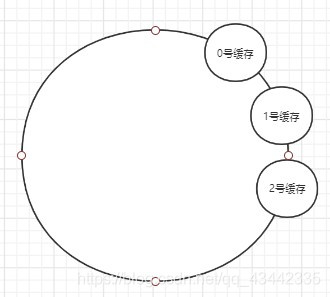
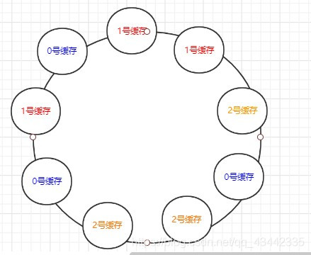

# 负载均衡算法
## 分类
负载均衡从决策者来看，分为两种：
- 服务端负载均衡

    比如业务访问某一台服务器，这个服务器再根据后续服务节点的负载情况、结合不同的负载均衡策略进行路由。
- 客户端负载均衡

    在微服务架构下，很多rpc框架会在调用方处提供一个proxy，proxy能够从注册中心拿到所有的服务节点列表，然后proxy来决定具体调用哪一个，这就属于客户端的负载均衡。

## 随机
- 完全随机

    有n个节点，就维护大小为n的列表。每次需要决策时生成一个[0, n)的随机整数，idx对应哪个节点，就调度哪个节点。

    缺点： 节点性能不同，那些性能更强的节点应该承载更多流量。
- 加权随机1

    有n个节点，每个节点都有一个权值k，那么k为几，就往列表中把这个节点重复添加几次。调度时生成一个[0, k0+k1+...+kn）的随机整数。

    缺点： 实现非常简单，但是如果节点很多、权重很高，这个列表会浪费大量的内存，于是可以随机数区间划分的方式来实现
- 加权随机2

    n个节点，则维护大小为n的列表，每次决策时生成一个[0, k0+k1+...+kn)的随机整数，而这个整数区间进行划分映射。
    
    例如k0 = 1, k1 = 3, k2 = 4，那么 [1] -> n1   [2, 3, 4] -> n2  [5, 6, 7, 8] -> n3

## 轮询
- 完全轮询

    与完全随机类似，但维护一个游标，指向下一个需要调度的节点。

- 加权轮询

    在维护游标的同时，再维护下一个调度节点的剩余调度次数，每调度一次减一，变为0时游标才挪到下一个节点并获取其权值大小对应的调度次数。

    调度次数： 以节点的权值比例，以及单个节点连续调度的最大次数为基础，来设计各个节点的最大调度次数。

- 平滑加权轮询

    考虑加权轮询的场景，假设现在游标指向n2，剩余调度次数是10，此时系统突然并发了10个请求，它们会被全部打到n2上，而其他节点啥也不干，这是我们不希望看到的。

    于是有了平滑加权轮询算法：其思想是，在保留加权效果的前提下，让短时间内压力大的服务器暂时变小，进而让其他空闲服务器承接流量。

    具体地，算法如下：

    假设三个节点n1 n2 n3 初始权重为 5 1 1, 第一次根据权重最大值调度到n1，那么用n1当前权重 减去 所有节点权重和， 得到n1节点的非固定权重，即 5 - 7 = -2，  n2 n3的非固权重与初始权重一样 分别是 1 1 
    
    第二次调度之前，需要将第一轮得到的三个节点的非固定权重，加到初始固定权重上：  即 5 1 1 ->  5-2 1+1 1+1 -> 3 2 2， 这一轮依然选择权重最大的n1，此时非固定权重变为 -4 2 2 
    
    第三轮，初始权重为 5 1 1 -> 5-4 1+2 1+2 -> 1 3 3，此轮调度n2，得非固定权重：1 -4 3
    
    第四轮，初始权重  5 1 1 -> 5+1 1-4 1+3 -> 6 -3 4，此轮调度n1, 得非固定权重：-1 -3 4
    
    第五轮，初始权重  5 1 1 -> 5-1 1-3 1+4 -> 4 -2 5，此轮调度n3, 得非固定权重：4 -2 -2
    
    第六轮，初始权重  5 1 1 -> 5+4 1-2 1-2 -> 9 -1 -1，此轮调度n1, 得非固定权重：2 -1 -1  
    
    第七轮，初始权重  5 1 1 -> 5+2 1-1 1-1 -> 7 0 0，此轮调度n1, 得非固定权重：0 0 0  
    
    第八轮，初始权重  5 1 1 -> 5+0 1+0 1+0 -> 5 1 1，此轮调度n1, 得非固定权重：-2 1 1  

    > 该算法的神奇之处在于，经过一轮循环之后，节点的调度次数确实是按照加权比例分配的，且调度之前的权值又会变回最初的固定权值。其优点在于将连续的请求分散到了不同节点，而不是一直压在某一个节点上。

## 哈希

基于哈希的负载均衡使用非常广泛，其基本思想是：

构建一个环形链表（每一个节点的值为0~2^32），先将所有服务节点的唯一标识取哈希，再通过取模运算（或其他算法）映射到链表上的某个位置；

对于系统某一个资源的请求（可以是根据入参、源ip等标识），取hash并取模映射到链表上的某一个位置，然后按照顺时针往后寻找，遇到的第一个服务节点，就是这次请求调度的目标节点。

其优点在于，当系统增加或减少服务节点时，只会有一小部分的请求会重新定位到另一台节点上，而不像基于bucket取模策略下，桶数变化导致所有key取模时的除数变化，进而所有桶内的key都发生迁移。

这就是所谓一致性哈希，它指的是，当桶数量变化时，绝大多数的key的映射关系不变，只有少部分key的映射位置发生改变。

最简单的一致性哈希依然存在问题：
- 数据倾斜

上面有提到，环形链表的空位多至2^32，如果桶之间的间隔不均匀，就必然导致key会向某一个桶倾斜,就比如下图中，绝大多数的数据都会被塞到0号缓存里。

- 服务雪崩

即使三个桶的间隔均匀，key没有出现倾斜，考虑删除其中一个桶的场景，那么原本该桶内的所有元素都会被迁移到顺时针方向下一个桶内，这很有可能导致下一个桶的负载激增，如果这个服务扛不住崩溃了，那么这两个桶内的key又会被转移到下一个桶上，导致服务雪崩。

> 解决办法： 引入虚拟节点

即给每个节点都复制几个分身，并将每个节点的分身均匀地分布在环上

当一个key顺时针遇到一个节点之后，如果它是一个分身，则需要映射到它的本体，再将key写到本体内。

如此，如果所有数据能够均匀地映射到环上，那么必然会均匀地落到各个桶内。

另一方面，如果移除一个桶，它内部的key会从环内的多个地方开始顺时针寻找下一个桶，进而能够将这些负载均匀地分散到其他桶内。

