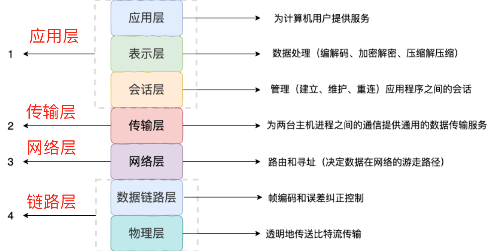

# 计算机网络基础
## 网络模型
- OSI 七层模型

    Open System Interconnection Reference Model, 由国际标准化组织提出，一个试图使各种计算机在世界范围内互联为网络的标准框架。

    具体包含：
   
    

    七层模型概念清晰、理论完整，但是比较复杂且不实用，功能上很多层也存在重复。
- TCP/IP 四层模型
    
    可以看做是OSI七层模型的精简版，至今还被广泛采用：

    

### 应用层协议
- HTTP（Hypertext Transfer Protocol，超文本传输协议）：基于 TCP 协议，是一种用于传输超文本和多媒体内容的协议，主要是为 Web 浏览器与 Web 服务器之间的通信而设计的。当我们使用浏览器浏览网页的时候，我们网页就是通过 HTTP 请求进行加载的。
- SMTP（Simple Mail Transfer Protocol，简单邮件发送协议）：基于 TCP 协议，是一种用于发送电子邮件的协议。注意 ⚠️：SMTP 协议只负责邮件的发送，而不是接收。要从邮件服务器接收邮件，需要使用 POP3 或 IMAP 协议。
- POP3/IMAP（邮件接收协议）：基于 TCP 协议，两者都是负责邮件接收的协议。IMAP 协议是比 POP3 更新的协议，它在功能和性能上都更加强大。IMAP 支持邮件搜索、标记、分类、归档等高级功能，而且可以在多个设备之间同步邮件状态。几乎所有现代电子邮件客户端和服务器都支持 IMAP。
- FTP（File Transfer Protocol，文件传输协议） : 基于 TCP 协议，是一种用于在计算机之间传输文件的协议，可以屏蔽操作系统和文件存储方式。注意 ⚠️：FTP 是一种不安全的协议，因为它在传输过程中不会对数据进行加密。建议在传输敏感数据时使用更安全的协议，如 SFTP。
- Telnet（远程登陆协议）：基于 TCP 协议，用于通过一个终端登陆到其他服务器。Telnet 协议的最大缺点之一是所有数据（包括用户名和密码）均以明文形式发送，这有潜在的安全风险。这就是为什么如今很少使用 Telnet，而是使用一种称为 SSH 的非常安全的网络传输协议的主要原因。
- SSH（Secure Shell Protocol，安全的网络传输协议）：基于 TCP 协议，通过加密和认证机制实现安全的访问和文件传输等业务RTP（Real-time Transport Protocol，实时传输协议）：通常基于 UDP 协议，但也支持 TCP 协议。它提供了端到端的实时传输数据的功能，但不包含资源预留存、不保证实时传输质量，这些功能由 WebRTC 实现。
- DNS（Domain Name System，域名管理系统）: 基于 UDP 协议，用于解决域名和 IP 地址的映射问题。
### 传输层协议
- TCP（Transmission Control Protocol，传输控制协议 ）：提供 面向连接 的，可靠 的数据传输服务。
- UDP（User Datagram Protocol，用户数据协议）：提供 无连接 的，尽最大努力 的数据传输服务（不保证数据传输的可靠性），简单高效。

# TCP
## 如何保证可靠性传输？
1. 大小控制 
    - 负载数据会被分成TCP认为最适合发送的大小的数据包
2. 序列号机制
    - 每一个数据包都会有一个编号，接收方在收到所有数据包之后会进行排序传递给应用层
    - 接收端会丢弃已经收到过的包，同时会再次回传本数据包序号对应的ACK
3. 检验和
    - 对于每一个数据包，接收方都会计算数据的检验和，并与头部中的检验和作比较，如果不一致则说明数据包在传输过程中内容发生过改变，将其丢弃并不会发送该数据包的ACK
4. 流量控制
    - TCP采用了滑动窗口协议，限制发送方发出的数据流量，从而使得发送速率不超过接收方接受速率的一种技术，其具体的实现有：
        - 停止-等待协议： 相当于发送和接受窗口大小都是1，发送方收到上一个包的ACK，才会发下一个包，超时了则会重发上一个包。
        - 后退N协议：发送窗口大于1，接收窗口等于1，接收方维护nextExpectPack，如果收到的不是期待的数据包直接丢弃并发送上一个期待数据包的ACK，发送方每收到一个ACK则说明接收方已经拿到了这个包以及之前的所有包，如果有一个包的ACK超时还没有拿到，则要重发这个包以及它之后的所有包。
        - 选择重传协议：发送和接受窗口都大于1，发送方最多可以一次性将窗口内所有包都发出去，但只有在收到首部包ACK之后才会往后挪动窗口，如果某个包的ACK超时则重传这个包；接收方可以任意顺序接受窗口范围内的数据包，收到的包发送ACK，仅当首部出现连续的数据包时，才会往后挪动窗口。
        - TCP的流量控制其实是GBN（准确说是累计确认理念）和SR的结合体（它的响应报文其实包含ACK和SACK两部分，详见下图）

        

        注意看，当接收方丢失2而接收到失序到达的3和4时，回复的包分别是（Ack1, Sack3）和（Ack1, Sack3-4），这里告诉发送方，我拿到了3、4两个包，但是缺了1。如果还有个5也到了，那么接收方就会回复(Ack1, Sack3-5)，此时发送方收到连续三个ACK1，就会触发快重传机制（下面拥塞控制会提到），所以TCP中的选择重传和快重传是不冲突的。
5. 拥塞控制
    TCP引入了「拥塞窗口cwnd」的概念，初始值较小（在不同OS中有不同实现，取值也不同）；还有一个慢启动窗口大小阈值ssthresh（不同OS不同，书上说一开始与cwnd一样大）。

    TCP协议发送数据包的过程分为两个阶段：慢启动和拥塞控制。
    - 慢启动 --- initcwnd指数式地增长，sstresh跟它一起增大，当出现超时重传时，ssthresh砍为一半。
    - 拥塞避免 --- 当ssthresh减半之后，进入到拥塞避免阶段，此后cwnd开始以1为单位递增；注意到，这里的cwnd在TCP Tahoe版本中每次出发超时重传就会变回1，而在TCP Reno版开始是减半（这就是所谓的快恢复）。

    

    快重传和快恢复：这俩概念是拥塞控制里的，我们仅考虑个别数据包丢失的情况，说的是对于接收方来说，如果收到了乱序到达的包就会先缓存它们，而发送那个丢失包的ACK。当发送方连续收到某一个包的三个ACK时，说明当前网络中出现了拥塞，已经开始丢包了，那么会触发快恢复（即ssthresh和cwnd减半后再慢逐渐+1），并立即重发那个被三次ACK的包。对于接收方拿到这个包之后，会将其与缓存的乱序包进行排序组合，如果顺序对了，那么发送最后一个包的ACK（快重传和TCP的选择重传其实并不冲突，后者是累计确认和选择重传的结合体）
# HTTP
# PING
# DNS