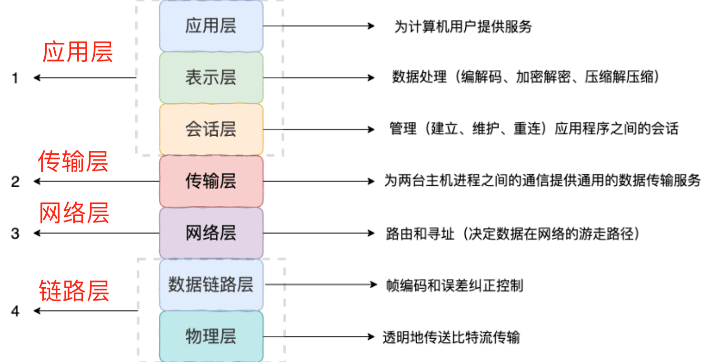
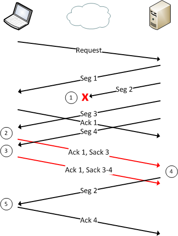
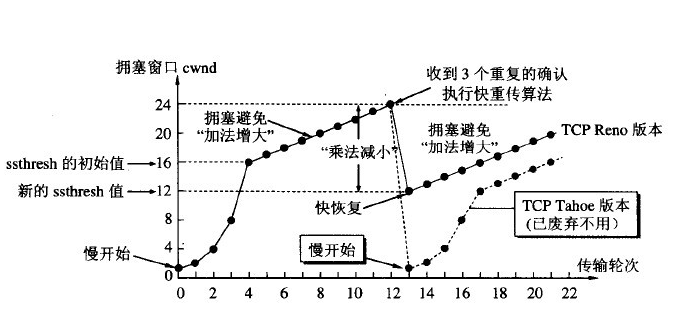
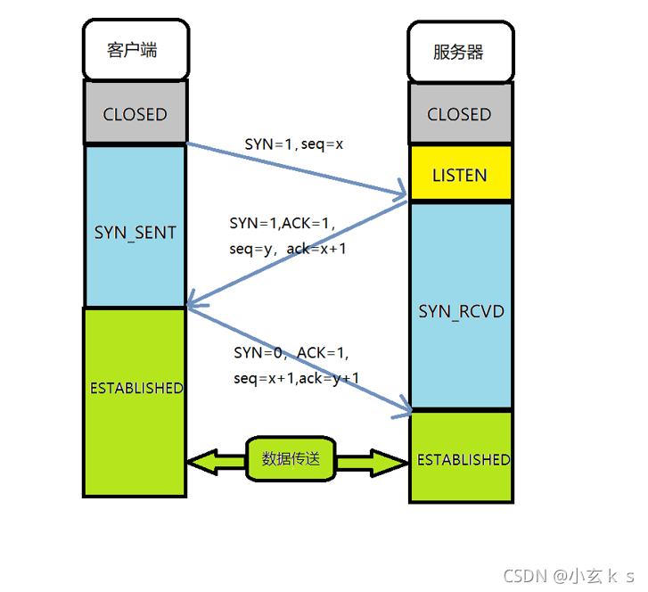
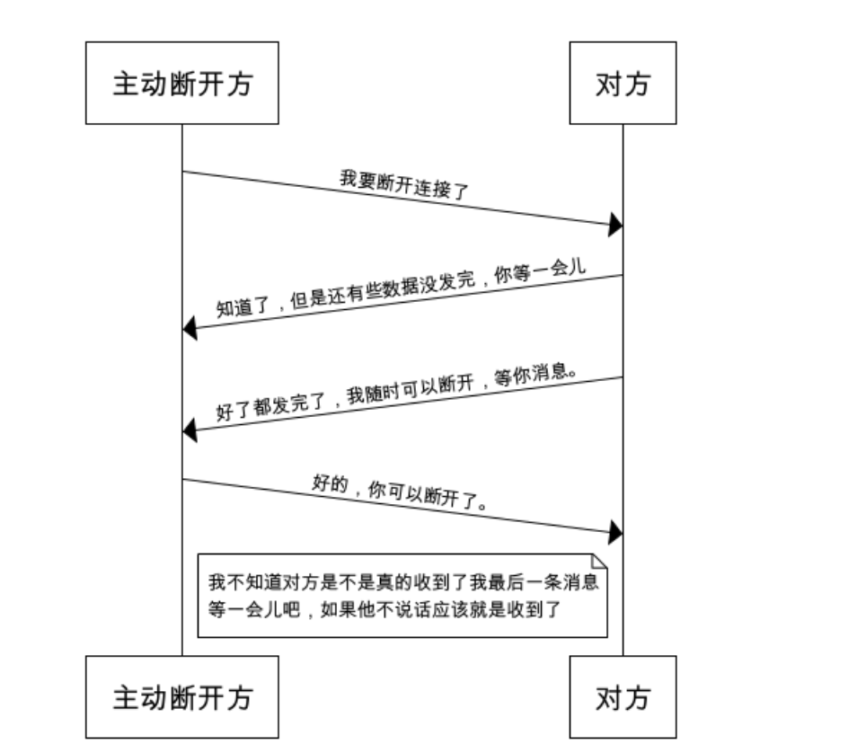
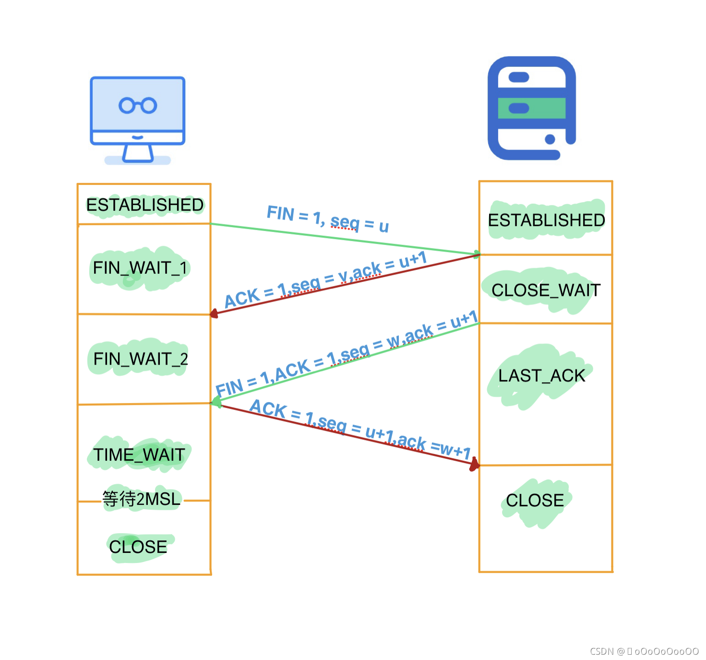

# 计算机网络基础
## 网络模型
- OSI 七层模型

    Open System Interconnection Reference Model, 由国际标准化组织提出，一个试图使各种计算机在世界范围内互联为网络的标准框架。

    具体包含：
   
    

    七层模型概念清晰、理论完整，但是比较复杂且不实用，功能上很多层也存在重复。
- TCP/IP 四层模型
    
    可以看做是OSI七层模型的精简版，至今还被广泛采用：

    

### 应用层协议
- HTTP（Hypertext Transfer Protocol，超文本传输协议）：基于 TCP 协议，是一种用于传输超文本和多媒体内容的协议，主要是为 Web 浏览器与 Web 服务器之间的通信而设计的。当我们使用浏览器浏览网页的时候，我们网页就是通过 HTTP 请求进行加载的。
- SMTP（Simple Mail Transfer Protocol，简单邮件发送协议）：基于 TCP 协议，是一种用于发送电子邮件的协议。注意 ⚠️：SMTP 协议只负责邮件的发送，而不是接收。要从邮件服务器接收邮件，需要使用 POP3 或 IMAP 协议。
- POP3/IMAP（邮件接收协议）：基于 TCP 协议，两者都是负责邮件接收的协议。IMAP 协议是比 POP3 更新的协议，它在功能和性能上都更加强大。IMAP 支持邮件搜索、标记、分类、归档等高级功能，而且可以在多个设备之间同步邮件状态。几乎所有现代电子邮件客户端和服务器都支持 IMAP。
- FTP（File Transfer Protocol，文件传输协议） : 基于 TCP 协议，是一种用于在计算机之间传输文件的协议，可以屏蔽操作系统和文件存储方式。注意 ⚠️：FTP 是一种不安全的协议，因为它在传输过程中不会对数据进行加密。建议在传输敏感数据时使用更安全的协议，如 SFTP。
- Telnet（远程登陆协议）：基于 TCP 协议，用于通过一个终端登陆到其他服务器。Telnet 协议的最大缺点之一是所有数据（包括用户名和密码）均以明文形式发送，这有潜在的安全风险。这就是为什么如今很少使用 Telnet，而是使用一种称为 SSH 的非常安全的网络传输协议的主要原因。
- SSH（Secure Shell Protocol，安全的网络传输协议）：基于 TCP 协议，通过加密和认证机制实现安全的访问和文件传输等业务RTP（Real-time Transport Protocol，实时传输协议）：通常基于 UDP 协议，但也支持 TCP 协议。它提供了端到端的实时传输数据的功能，但不包含资源预留存、不保证实时传输质量，这些功能由 WebRTC 实现。
- DNS（Domain Name System，域名管理系统）: 基于 UDP 协议，用于解决域名和 IP 地址的映射问题。
### 传输层协议
- TCP（Transmission Control Protocol，传输控制协议 ）：提供 面向连接 的，可靠 的数据传输服务。
- UDP（User Datagram Protocol，用户数据协议）：提供 无连接 的，尽最大努力 的数据传输服务（不保证数据传输的可靠性），简单高效。
### 网络层协议
- IP（Internet Protocol，网际协议）：TCP/IP 协议中最重要的协议之一，属于网络层的协议，主要作用是定义数据包的格式、对数据包进行路由和寻址，以便它们可以跨网络传播并到达正确的目的地。目前 IP 协议主要分为两种，一种是过去的 IPv4，另一种是较新的 IPv6，目前这两种协议都在使用，但后者已经被提议来取代前者。
- ARP（Address Resolution Protocol，地址解析协议）：ARP 协议解决的是网络层地址和链路层地址之间的转换问题。因为一个 IP 数据报在物理上传输的过程中，总是需要知道下一跳（物理上的下一个目的地）该去往何处，但 IP 地址属于逻辑地址，而 MAC 地址才是物理地址，ARP 协议解决了 IP 地址转 MAC 地址的一些问题。
- ICMP（Internet Control Message Protocol，互联网控制报文协议）：一种用于传输网络状态和错误消息的协议，常用于网络诊断和故障排除。例如，Ping 工具就使用了 ICMP 协议来测试网络连通性。
- NAT（Network Address Translation，网络地址转换协议）：NAT 协议的应用场景如同它的名称——网络地址转换，应用于内部网到外部网的地址转换过程中。具体地说，在一个小的子网（局域网，LAN）内，各主机使用的是同一个 LAN 下的 IP 地址，但在该 LAN 以外，在广域网（WAN）中，需要一个统一的 IP 地址来标识该 LAN 在整个 Internet 上的位置。
- OSPF（Open Shortest Path First，开放式最短路径优先） ）：一种内部网关协议（Interior Gateway Protocol，IGP），也是广泛使用的一种动态路由协议，基于链路状态算法，考虑了链路的带宽、延迟等因素来选择最佳路径。
- RIP(Routing Information Protocol，路由信息协议）：一种内部网关协议（Interior Gateway Protocol，IGP），也是一种动态路由协议，基于距离向量算法，使用固定的跳数作为度量标准，选择跳数最少的路径作为最佳路径。
- BGP（Border Gateway Protocol，边界网关协议）：一种用来在路由选择域之间交换网络层可达性信息（Network Layer Reachability Information，NLRI）的路由选择协议，具有高度的灵活性和可扩展性。
# TCP
## 如何保证可靠性传输？
1. 大小控制 
    - 负载数据会被分成TCP认为最适合发送的大小的数据包
2. 序列号机制
    - 每一个数据包都会有一个编号，接收方在收到所有数据包之后会进行排序传递给应用层
    - 接收端会丢弃已经收到过的包，同时会再次回传本数据包序号对应的ACK
3. 检验和
    - 对于每一个数据包，接收方都会计算数据的检验和，并与头部中的检验和作比较，如果不一致则说明数据包在传输过程中内容发生过改变，将其丢弃并不会发送该数据包的ACK
4. 流量控制
    - TCP采用了滑动窗口协议，限制发送方发出的数据流量，从而使得发送速率不超过接收方接受速率的一种技术，其具体的实现有：
        - 停止-等待协议： 相当于发送和接受窗口大小都是1，发送方收到上一个包的ACK，才会发下一个包，超时了则会重发上一个包。
        - 后退N协议：发送窗口大于1，接收窗口等于1，接收方维护nextExpectPack，如果收到的不是期待的数据包直接丢弃并发送上一个期待数据包的ACK，发送方每收到一个ACK则说明接收方已经拿到了这个包以及之前的所有包，如果有一个包的ACK超时还没有拿到，则要重发这个包以及它之后的所有包。
        - 选择重传协议：发送和接受窗口都大于1，发送方最多可以一次性将窗口内所有包都发出去，但只有在收到首部包ACK之后才会往后挪动窗口，如果某个包的ACK超时则重传这个包；接收方可以任意顺序接受窗口范围内的数据包，收到的包发送ACK，仅当首部出现连续的数据包时，才会往后挪动窗口。
        - TCP的流量控制其实是GBN（准确说是累计确认理念）和SR的结合体（它的响应报文其实包含ACK和SACK两部分，详见下图）

        

        注意看，当接收方丢失2而接收到失序到达的3和4时，回复的包分别是（Ack1, Sack3）和（Ack1, Sack3-4），这里告诉发送方，我拿到了3、4两个包，但是缺了1。如果还有个5也到了，那么接收方就会回复(Ack1, Sack3-5)，此时发送方收到连续三个ACK1，就会触发快重传机制（下面拥塞控制会提到），所以TCP中的选择重传和快重传是不冲突的。
5. 拥塞控制
    TCP引入了「拥塞窗口cwnd」的概念，初始值较小（在不同OS中有不同实现，取值也不同）；还有一个慢启动窗口大小阈值ssthresh（不同OS不同，书上说一开始与cwnd一样大）。

    TCP协议发送数据包的过程分为两个阶段：慢启动和拥塞控制。
    - 慢启动 --- initcwnd指数式地增长，sstresh跟它一起增大，当出现超时重传时，ssthresh砍为一半。
    - 拥塞避免 --- 当ssthresh减半之后，进入到拥塞避免阶段，此后cwnd开始以1为单位递增；注意到，这里的cwnd在TCP Tahoe版本中每次出发超时重传就会变回1，而在TCP Reno版开始是减半（这就是所谓的快恢复）。

    

    快重传和快恢复：这俩概念是拥塞控制里的，我们仅考虑个别数据包丢失的情况，说的是对于接收方来说，如果收到了乱序到达的包就会先缓存它们，而发送那个丢失包的ACK。当发送方连续收到某一个包的三个ACK时，说明当前网络中出现了拥塞，已经开始丢包了，那么会触发快恢复（即ssthresh和cwnd减半后再慢逐渐+1），并立即重发那个被三次ACK的包。对于接收方拿到这个包之后，会将其与缓存的乱序包进行排序组合，如果顺序对了，那么发送最后一个包的ACK（快重传和TCP的选择重传其实并不冲突，后者是累计确认和选择重传的结合体）

## 三次握手
TCP协议是一个全双工协议，允许连接双方同时向对方发送消息。

对于连接的一个方向，如果要保持可靠性传输，就必须保证客户端的发送能力、服务端的接受能力均正常；具体地，就是我发一个包，然后收到对方回复的一个包，即证明对方能收、也能发。

于是TCP建立双向连接的过程就是为了确认客户端的发送、接受能力，以及服务端的发送、接受能力均正常。

TCP连接创建的本质就是：客户端打招呼 ->  服务端回应 -> 服务端打招呼 -> 客户端回应

只不过在上述过程中的第二步、第三步可以结合在一起，服务端可以通过一个数据包同时发送ACK和SYN。

三次握手指的就是在上述过程中，总共有三个数据包被发出并接收，

## 四次挥手
连接断开的过程其本质是：

具体的状态流转示意图如下：

### TIME_WAIT状态有何作用，为什么是2MSL？
在上述断开流程中，是A最后断开，而B先断开。

对于A来说，他最后发送的ACK，是B断开连接的最终信号。

MSL(Maximum Segment Lifetime)报文最大生存时间，即TCP一个数据包在网络层能存活的最大时间，超过了则这个包永远不可能到达接受方；换句话说，一个数据包如果能到达，则一定会在MSL内到达。

如果B没有收到这个ACK，则最多在1MSL后，B会重发FIN，而这个FIN最迟会在1MSL后到被A收到，此后A再重发ACK，重复上述的过程。

如果B收到了这个ACK，则B会成功断开，那么A等完2MSL都没有收到重复的FIN，就知道B已经收到ACK并且断开了，于是A也可以放心断开。

具体的作用：
- 确保B能够成功变为CLOSED状态，如果B没有收到ACK，则会一直处于LAST_ACK状态；此时如果有新的客户端向B发出SYNC包试图创建连接，B会直接返回RST拒绝掉这个请求，即B无法继续工作。
- 确保此次会话中的所有数据包都已经在网络层消亡（B在发出FIN之前，会清空缓存区，将所有数据都发完）。如果上一次回话的数据包在下一次回话时到达，即使TCP通信双方的seq码都是随机的，但依然可能产生影响。

### 系统出现大量TIME_WAIT会怎么样，怎么办？
在RFC 793中定义MSL通常为2分钟，当某系统中出现大量主动断开的TCP连接时，就会出现非常多的TIME_WAIT状态连接。

注意到，TIME_WAIT状态只会出现在主动断开tcp连接的一方。

在linux系统中，标识一个tcp连接的是四元组<源ip，源port，目标ip，目标port>，于是考虑一个在8080端口开放的web服务，与客户端创建的所有连接都只会占用服务端的8080端口；即使出现大量TIME_WAIT状态的连接，也不会有所谓的「端口被占满」的问题。

真正会遇到的问题如下：

- 每一个未被释放的tcp连接都对应了一个socketfd，这个文件描述符会占用系统的内存资源。
- 如果服务端机器上装有nginx等反向代理，那么客户端到服务端的连接，其实可以拆分成： 

    客户端 -> nginx(作为服务端) + nginx（作为客户端） -> server(作为服务端)

    当服务端大量互动断开tcp连接时，会有很多占用8080端口的TIME_WAIT状态TCP连接。而这些连接在断开时，nginx也需要主动断开到客户端的连接，此时又会有很多占用80端口的TIME_WAIT状态TCP连接。这都不会造成端口占满。

    当服务端返回的响应头中connection的值为close时，nginx就会在回写完body之后，主动断开到server的连接，这个环节会出现大量占用不同系统端口的TIME_WAIT连接，进而引发服务器无法创建新的TCP连接。
### 解决办法
- 代码层修改
    server层、nginx层、客户端都把短连接改为长连接。
- 修改ip_local_port_range，增大系统可用端口范围。
- 修改客户端程序中的SO_LINGER，可以改变其调用close()关闭TCP连接之后的行为，比如收到FIN包之后直接丢弃缓冲区内所有数据并直接发送RST报文给服务端，这样服务端就可以从根本上避免TIME_WAIT状态，但这么做打破了TCP规范的断开流程，存在丢失数据的风险。
# HTTP
# PING
# DNS